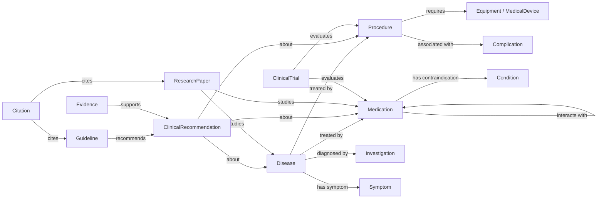
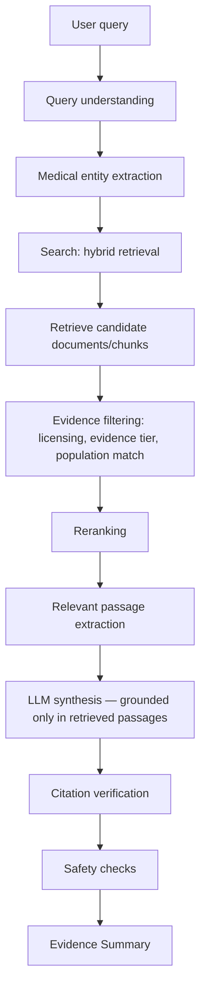
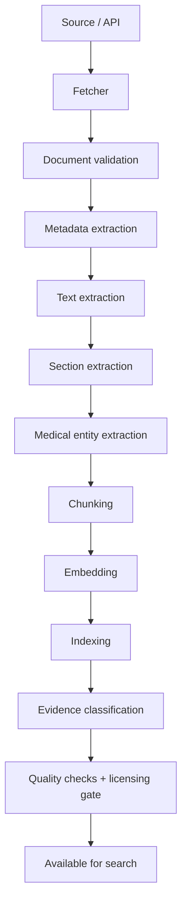
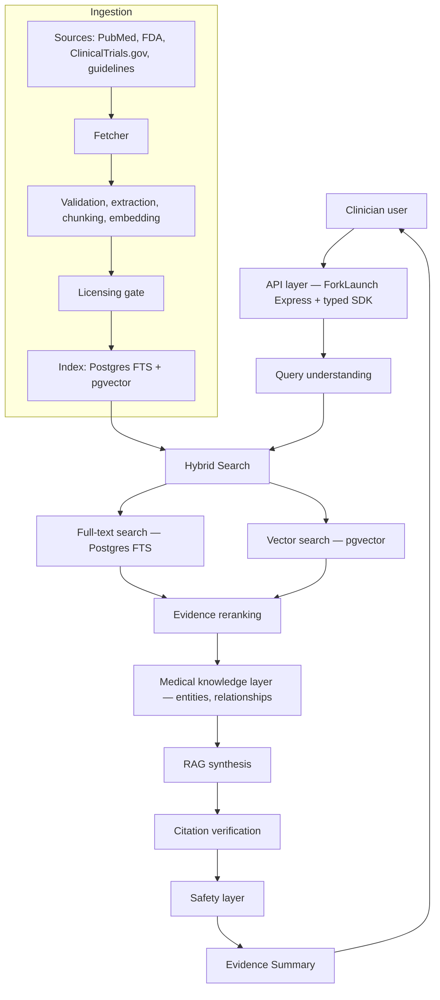

# Medical Literature Search Engine — Planning Document

Status: **DRAFT — planning/specification only. No implementation has started.**

This document is a specification, not an implementation. Nothing described here has been built unless the "Existing ForkLaunch Architecture" section says so explicitly and cites a real path in the repository.

## How to read this document

Every substantive statement is tagged:

| Tag | Meaning |
|---|---|
| **FACT** | Verified by reading the repository at the commit this document was written against. A path or code reference is given. |
| **ASSUMPTION** | Believed likely true but not verified against a real system (e.g. clinical workflow assumptions, adopter behavior). |
| **PROPOSAL** | A design choice being recommended. Not yet agreed, not yet built. |
| **OPEN QUESTION** | Genuinely undecided. Needs a founder/clinical/legal/engineering decision before design can proceed. |
| **RISK** | A way this could fail, be misused, or cause harm. Cross-referenced in the Risk Register (§18). |
| **TBD** | Explicitly unknown. Not guessed. |

Untagged prose is structural/explanatory text (headings, table framing) and carries no independent claim.

---

## 0. Executive Summary

**PROPOSAL.** Build a medical-literature and clinical-knowledge search engine — not a diagnostic tool, not a prescribing tool — that lets a clinician search a clinical topic ("open heart surgery", "metformin dosing in renal impairment", "post-op DVT prophylaxis") and get a structured, evidence-graded, fully-cited summary assembled from authoritative medical sources, with retrieval-augmented generation (RAG) doing synthesis on top of a strictly grounded evidence base — never on model memory alone.

**FACT.** This would be built as a new ForkLaunch **blueprint module** (`blueprint/medical-search-base/` or similar), following the exact same architectural pattern as the existing `blueprint/cac-base` (computer-assisted-coding) module: a standalone Express-based service with MikroORM persistence, DI-based service wiring, tenant-scoped multi-org data isolation, compliance-classified entities, and a typed SDK — reusing the framework's existing IAM, billing, Redis, S3, and worker infrastructure rather than inventing new plumbing for those concerns.

**OPEN QUESTION.** ForkLaunch has no existing full-text/vector search infrastructure, no existing medical-terminology licensing relationships (UMLS/SNOMED/RxNorm), and no existing frontend in this repository at all (see §1). All three are net-new work and net-new legal/licensing relationships this plan depends on. This is the single biggest scope driver in the whole document.

---

## 1. Existing ForkLaunch Architecture

This section is built entirely from reading the repository (`forklaunch-js`, branch state as of this document). It does not speculate about capabilities the repo doesn't demonstrate.

### 1.1 What ForkLaunch actually is

**FACT.** Per `README.md`: ForkLaunch is a backend framework and infrastructure platform — type-safe Express (via Zod or TypeBox schema validators), a Rust CLI that scaffolds and wires services/workers/libraries, DI-driven infrastructure (auth, DB, cache, storage, queues), auto-generated OpenAPI/AsyncAPI specs and typed client SDKs, and OpenTelemetry-based observability. It is **not** a product; it is what products are built on top of. There is no ForkLaunch "app" with a UI in this repository — this repo is the framework, CLI, and a library of reusable backend module blueprints.

### 1.2 Repository layout

**FACT.** Three top-level areas, each its own pnpm workspace (confirmed via separate `pnpm-workspace.yaml` files — this matters, see §1.7):

| Area | Contents |
|---|---|
| `framework/` | The published npm packages: `core`, `express`, `hyper-express`, `validator`, `universal-sdk`, `testing`, `internal`, `bunrun`, `ws`, `infrastructure/redis`, `infrastructure/S3` |
| `blueprint/` | Reusable backend module blueprints: `billing-base`/`billing-stripe`, `iam-base`/`iam-better-auth`, `messaging-base`/`messaging-twilio`, `ecommerce-stripe`, `cac-base`, plus `core`, `monitoring`, `client-sdk`, `interfaces/*`, `implementations/*` |
| `cli/` | A Rust CLI (`forklaunch`) that scaffolds new applications, services, workers, libraries, and "modules" (pre-built blueprints like the ones above) into a customer's own generated project |

**FACT.** `docs/learn/architecture.md` describes what a *generated* application looks like: a `src/modules/` monorepo with a shared `core` (DI registrations + RBAC), `monitoring` (OpenTelemetry config, Grafana dashboards), and `universal-sdk` package, plus a `docker-compose.yaml` running the LGTM observability stack (Loki, Grafana, Tempo, Mimir) and MinIO (S3-compatible storage).

### 1.3 Canonical module anatomy (from `blueprint/cac-base` and `blueprint/billing-base`)

**FACT.** Every blueprint module follows the same shape:

```
<module>/
├── bootstrapper.ts        # instantiates the DI container, exports { ci, tokens }
├── registrations.ts       # DI wiring: config schema, runtime deps, services
├── mikro-orm.config.ts    # MikroORM datasource config
├── server.ts              # Express app entry point
├── sdk.ts                 # typed SDK surface (MapToSdk) for client-sdk generation
├── surfacing.ts           # OpenAPI/AsyncAPI surfacing
├── domain/
│   ├── enum/
│   ├── schemas/           # Zod/TypeBox request/response schemas
│   └── types/
├── persistence/
│   ├── entities/          # MikroORM entities, compliance-classified
│   └── seed.data.ts / seeder.ts
├── migrations/            # hand-written or generated MikroORM migrations
├── api/
│   ├── controllers/       # handlers.get/post/put/delete + auth + responses
│   └── routes/
├── services/               # business logic, injected via DI
├── scripts/                # e.g. retention enforcement, data refresh jobs
└── __test__/               # vitest/jest unit + e2e (testcontainers)
```

### 1.4 Dependency injection & service wiring

**FACT.** `createConfigInjector` (from `@forklaunch/core/services`) builds a chained injector: a `configInjector` (env-driven config schema) chained into `runtimeDependencies` (DB connection, `EntityManager`, cache, encryption) chained into `serviceDependencies` (business services). Each registration declares a `Lifetime` (`Singleton` or `Scoped`) and a `factory` that destructures its dependencies by name. `bootstrapper.ts` exports `{ ci, tokens }`; controllers resolve singletons with `ci.resolve(tokens.X)` and request-scoped services with `ci.scopedResolver(tokens.X)`, called per-request as `serviceFactory({ context: {...} })`.

### 1.5 Persistence, multi-tenancy, and compliance (verified in depth via the `cac-base` PR this session)

**FACT.** Persistence is MikroORM. Entities are declared via `defineComplianceEntity` (from `@forklaunch/core/persistence`), which requires every field to carry a `compliance()` classification (`'none' | 'pii' | 'phi' | 'pci'`). Fields classified `pii`/`phi`/`pci` are backed by a MikroORM `EncryptedType` (AES-256-GCM, HKDF-derived per-tenant key via `FieldEncryptor`).

**FACT.** Multi-tenancy is enforced two ways simultaneously: (1) a MikroORM global filter (`tenantFilter.ts`, filter name `tenant`) that adds `WHERE organizationId = :tenantId` to every query on an entity that has that column, and fails **open** (no filtering) if no tenant context is set; (2) an `AsyncLocalStorage`-based encryption-tenant context (`tenantEm.ts`, `encryptedType.ts`) that determines which per-tenant key `EncryptedType` fields decrypt/encrypt under. Both must be engaged via `wrapEmWithTenantContext(em, tenantId)` on every request-scoped `EntityManager` — omitting it is a real, previously-shipped bug class in this codebase (both `billing-base` and, until this session, `cac-base`'s GDPR erase/export path had this gap).

**FACT.** A generic `ComplianceDataService` (framework/core) implements GDPR erase/export by walking all `defineComplianceEntity`-registered entities and matching a configurable per-entity `userIdField`. A `RetentionService` enforces per-entity retention policies (delete or anonymize after a duration).

**FACT.** Row-level security exists as a documented mechanism (`RlsEventSubscriber`, referenced in code comments) alongside the MikroORM filter — i.e., Postgres RLS is part of the intended defense-in-depth, not just an app-level filter.

**Implication for this project (PROPOSAL):** A medical-search module holding hospital-specific data (saved searches, audit logs, any patient-context features added later) should use exactly this same compliance/tenancy machinery — not invent a parallel one. Pure medical-literature content (drug labels, guidelines, papers) is not tenant data and should **not** be organization-scoped or encrypted; only per-hospital usage data would be.

### 1.6 Auth & RBAC

**FACT.** Two IAM modules exist: `iam-base` ("authorization only" per the CLI's own module description) provides organization/user/role/permission CRUD and JWT **verification** via a `jwksPublicKeyUrl`; `iam-better-auth` wraps the `better-auth` library, presumably for actual login/session/token issuance (not independently verified in this session — **TBD** exact responsibility split at the code level beyond the CLI's one-line description).

**FACT.** RBAC primitives live in `blueprint/core/auth/rbac.ts`: `PERMISSIONS` (`platform:read`, `platform:write`, extensible), `ROLES` (`viewer`, `editor`, `admin`, `system`), and derived permission/role sets (`PLATFORM_READ_PERMISSIONS`, `PLATFORM_SYSTEM_ROLES`, etc.) consumed by controllers as `auth: { jwt: { jwksPublicKeyUrl }, allowedRoles / allowedPermissions }`. Modules extend this with their own permission slugs (e.g. `cac-base` defines `coder:manage_claims`).

### 1.7 Framework vs. blueprint are separate release trains — a real, previously-hit constraint

**FACT, verified the hard way this session.** `framework/` and `blueprint/` are **separate pnpm workspaces**. Blueprint modules consume framework packages (`@forklaunch/core`, etc.) as **published npm dependencies**, never as a local workspace link. A change to `framework/core` source does not reach a blueprint module until that package is versioned and published to npm, and the blueprint module's `package.json` pin is bumped. This exact gap has already caused real CI breakage on the `cac-base` module twice in this repo's history (an unpublished `@forklaunch/interfaces-cac` dependency, and a published `@forklaunch/implementation-cac-base` version whose *content* didn't actually include code the blueprint depended on). **Any plan that assumes "add a capability to `framework/core` and use it immediately in the new module" is wrong** — it must go through an actual release.

### 1.8 Infrastructure primitives that already exist

**FACT.**

| Package | Purpose | Confirmed capability |
|---|---|---|
| `@forklaunch/infrastructure-redis` | Cache | `RedisTtlCache` — TTL-based cache with a `FieldEncryptor` for encrypting cached values |
| `@forklaunch/infrastructure-s3` | Object storage | S3-compatible object store client (MinIO locally, per `docker-compose.yaml`) |
| `implementations/worker/{bullmq,kafka,redis,database}` | Async job/queue backends | Four interchangeable worker backends behind a common `interfaces/worker` contract; `bullmq` implementation has typed producer/consumer schemas |
| Monitoring stack | Observability | OpenTelemetry SDK + collector, Grafana/Loki/Tempo/Mimir (LGTM) via docker-compose, a shared `metricsDefinitions.ts` pattern (`http_requests_total`, `http_request_duration_ms`, `http_errors_total`, `http_requests_in_flight`, extensible) |
| `client-sdk`, `universal-sdk` | Typed SDKs | `MapToSdk` generates a typed client SDK from a module's `sdk.ts` surface; `universal-sdk` is a runtime-agnostic SDK caller |

**FACT — explicitly what does NOT exist:**

- **No full-text search engine** (no Elasticsearch/OpenSearch/Typesense/Meilisearch anywhere in the repo).
- **No vector database or embeddings infrastructure** (no pgvector, Pinecone, Weaviate, Qdrant references).
- **No medical terminology packages or licenses** (no UMLS/SNOMED CT/RxNorm/ICD/CPT integration beyond `cac-base`'s own ICD-10-CM/HCPCS/CPT code-set tables, which are billing-coding tables, not a clinical ontology/knowledge graph).
- **No LLM/RAG infrastructure** (no existing LLM client wrapper, prompt pipeline, or citation-grounding mechanism anywhere in `framework/` or `blueprint/`).
- **No frontend of any kind** — no `apps/`, no React/Vue/Svelte anywhere in this repository. Every "frontend" reference in ForkLaunch's own docs is about a *customer's own* frontend consuming the generated typed SDK.
- **No document ingestion/ETL pipeline for external literature.** The closest analogue is `cac-base`'s `CodeSetLoaderService` (a generic batch-upsert CSV loader for ICD-10/HCPCS/CPT reference tables) — structurally similar in *shape* to what a literature ingestion pipeline needs, but built for small structured code tables, not full-text documents at scale.

### 1.9 Where this module should live, and what's reusable vs. net-new

| Component | Status |
|---|---|
| Backend framework, DI, HTTP layer, OpenAPI/SDK generation | **Reuse as-is** — this is the whole value proposition of building on ForkLaunch |
| Multi-tenant Postgres + MikroORM + compliance/encryption/retention framework | **Reuse as-is** for any hospital-specific data (saved searches, org settings, audit); **do not use** for the literature corpus itself (not tenant data) |
| Auth/RBAC (`iam-base`, `blueprint/core/auth/rbac.ts`) | **Reuse as-is**, extended with module-specific permission slugs (pattern: `clinician:search`, `reviewer:approve_source`, etc.) |
| Redis cache, S3 object storage | **Reuse as-is** — S3/MinIO for raw ingested documents (PDFs, XML), Redis for query/result caching |
| Worker backends (bullmq/kafka/redis/database) | **Reuse as-is** for the async ingestion pipeline |
| Observability (OpenTelemetry, `metricsDefinitions`) | **Reuse as-is**, extended with module-specific metrics |
| Full-text/vector search | **Net-new infrastructure** — no existing package; needs a new `infrastructure/*` package (mirroring the `redis`/`S3` pattern) or a managed external service |
| Medical terminology (UMLS/SNOMED/RxNorm) | **Net-new licensing relationship** — nothing in this repo |
| LLM/RAG pipeline | **Net-new** — no existing LLM client, prompt orchestration, or citation-verification code anywhere in the framework |
| Frontend | **Net-new, and arguably out of scope for this repo** — would be a separate consumer application using the generated typed SDK, not something added to `forklaunch-js` itself |

### 1.10 Open questions from the architecture review

- **OPEN QUESTION:** Should this live as a single new blueprint module (`medical-search-base`), or be split (e.g. `medical-corpus-base` for ingestion/storage + `medical-search-base` for query/RAG), the way `cac-base` is one module but `billing` is split into `billing-base`/`billing-stripe` (hooks vs. provider implementation)? See §17 for a recommendation.
- **OPEN QUESTION:** Is a customer-facing frontend even in scope for this initiative, or is the deliverable an API + SDK that hospitals' own frontends (or a separate ForkLaunch product) consume? This changes the entire Frontend section (§11) from "build it" to "design the SDK surface it will need."

---

## 2. Product Vision

**PROPOSAL** (restating and sharpening the brief). A clinician searches a clinical topic and receives a structured, evidence-graded synthesis — not a list of links, not a chatbot answer from model memory. Example query: `"open heart surgery"`.

Structured result sections (per query type — see §5 for the full per-entity-type schema):

Overview · Definition · Indications · Contraindications · Patient preparation · Pre-operative evaluation · Procedure/workflow · Equipment · Anesthesia considerations · Medications · Typical duration · ICU/hospital considerations · Post-operative management · Follow-up · Complications · Relevant guidelines · Relevant research papers · Clinical trials · Evidence quality · Sources/citations.

**Non-negotiable, product-defining constraint:** every substantive medical claim in the output must be traceable to a specific cited source passage. An unsupported sentence is a defect, not a stylistic nitpick — see §9 (Evidence System) and §10 (AI/RAG) for the mechanism, and §12 (Safety Architecture) for what happens when that mechanism fails.

### 2.1 Competitive Landscape — why this, not an existing tool

**ASSUMPTION, not independently verified this session.** The characterizations below are general market awareness, not a hands-on competitive audit — flagged explicitly because a plan that skips this question entirely is answering "can we build this" without ever asking "should we, given what already exists."

| Existing tool | What it does (general understanding) | Where this plan's vision differs, or the gap it leaves |
|---|---|---|
| UpToDate (Wolters Kluwer) | Editorially-written, expert-authored point-of-care topic summaries — the incumbent most hospitals already pay for | Human-edited on a slow update cycle, not a live literature search engine; its citation trail is to the editors' own review process, not a queryable evidence graph over new papers/trials as they publish. This plan's differentiation is live, source-traceable synthesis over a broader, continuously-updated corpus — not a faster-updating encyclopedia. |
| OpenEvidence | An AI-native, citation-linked medical Q&A tool already positioned close to this plan's vision | **The closest existing competitor by concept**, as far as general awareness goes. If accurate, the differentiation this plan would need is either a narrower wedge (e.g. the structured procedure/surgery pages in §6.2, which general medical-Q&A tools don't specialize in) or a distribution advantage — bundled into a hospital's existing ForkLaunch-based systems (alongside `cac-base`, `billing-base`, `iam-base`) rather than sold as a standalone subscription tool. |
| Elicit, Consensus.app | General-purpose AI research-paper search/summarization, not medicine-specific | No clinical safety boundary (§3's category A–D split), no evidence grading for clinical practice, no medical entity/knowledge-graph layer (§7). The gap they leave is a clinician-safe, clinically-structured product — not raw paper search with a nicer UI. |
| PubMed / Google Scholar directly | The underlying literature index this whole system sits on top of | Zero synthesis, zero evidence grading, zero structured disease/procedure/medication pages. This is the raw material this plan indexes, not a competing product — the entire proposed value-add is the synthesis/safety/structure layer on top of exactly this kind of index. |

**OPEN QUESTION, and arguably the most consequential one added in this revision:** none of the above was verified against these products' actual current capabilities in this session — this table is market awareness, not a competitive audit. Before this document is used externally (with a founder, an investor, or a clinical partner), someone should actually run a handful of real clinical queries through OpenEvidence and UpToDate and compare outputs directly against §10's example UX. If a tool like OpenEvidence already does most of what §2–§11 describe, the real strategic question stops being "should we build this" and becomes "what does building it on ForkLaunch's existing hospital-infrastructure relationships (IAM, billing, the CAC precedent, §1) let us do that a standalone competitor can't" — i.e., a distribution/bundling advantage, not a novel feature set. That reframing changes the MVP (§21): it would shift toward proving the bundled-distribution thesis with an existing ForkLaunch hospital customer, rather than proving the synthesis technology in the abstract.

---

## 3. Core Principle: What This System Is and Is Not

**PROPOSAL.** The system answers *"what does the medical literature and authoritative evidence say?"* It is explicitly **not** an autonomous clinical decision-maker. Four categories, with sharply different regulatory exposure:

| Category | What it does | Regulatory posture | In scope? |
|---|---|---|---|
| **A. Medical literature / evidence retrieval** | Finds and returns real documents (guidelines, papers, drug labels) with full provenance | Lowest risk — functionally a specialized search engine over public/licensed medical literature | **Yes — this is the product** |
| **B. AI-generated evidence summary** | Synthesizes retrieved passages into a structured summary, every claim cited back to A | Moderate risk — accuracy of *synthesis*, not of clinical judgment; must never introduce claims not present in A | **Yes — this is the product's value-add over raw search** |
| **C. Clinical decision support (CDS)** | Recommends a course of action for a specific patient situation, evaluates patient-specific data against a rule/model | High regulatory risk — in the US, software that provides patient-specific diagnostic/treatment recommendations without letting the clinician independently review the basis may be regulated as a medical device (FDA's CDS software guidance, 21st Century Cures Act criteria) | **No — explicitly out of scope for this system** |
| **D. Patient-specific treatment / prescribing** | Determines an actual dose, treatment plan, or prescription for a named patient | Practicing medicine — requires a licensed clinician and, in most jurisdictions, is not something software does at all | **No — never in scope** |

**PROPOSAL — the enforcement mechanism, not just a policy statement:** the system must be **structurally** incapable of producing C/D-shaped output, not merely instructed not to. Concretely:

- The system never accepts or stores patient-identifying context as a search input in the MVP (see §13, "no patient data in phase 1").
- Medication results (§5.3) present *drug-label-level* information (indication, standard dosing ranges *as published in the label/guideline*, contraindications, interactions) — never "give patient X 500mg of Y." A dosing range from an FDA label ("500–1000mg every 8 hours for adults with normal renal function") is category A/B (it's a citation of a real document). "This patient should take 500mg" is category D and must be refused/redirected (§12).
- Any query that is detected as asking for D-shaped output (see §12.4 for detection heuristics) gets a structured refusal explaining the boundary, not a best-effort answer.

**OPEN QUESTION:** Where exactly the FDA would draw the CDS line for *this specific* product needs actual regulatory counsel, not an engineering guess — flagged again in §14.

---

## 4. Source Strategy

**PROPOSAL.** A source-hierarchy table. Values under "Evidence level," "Indexable," "Quotable," and "AI-summarizable" are **PROPOSAL** defaults pending legal review, not settled policy — see the licensing subsection immediately after.

| Source type | Example | Authority | Typical evidence level | Update frequency | Indexable? | Quotable (short excerpt)? | Usable for AI summary? |
|---|---|---|---|---|---|---|---|
| Clinical practice guideline | professional society guidelines (e.g. AHA/ACC, WHO) | High — consensus of a recognized body | Guideline (graded internally, e.g. Class I/IIa/IIb/III + Level A/B/C) | Periodic (years) | **PROPOSAL: yes**, metadata + structured recommendations | Yes, short excerpts with attribution | Yes — primary synthesis source |
| Government/regulatory (FDA, CDC, WHO, NIH/NLM) | FDA drug label, CDC guidance | Highest for regulatory facts (approved indication, label warnings) | Regulatory/official | Ongoing, versioned | Yes | Yes | Yes |
| ClinicalTrials.gov | trial registration + (if available) results | Registry of record | Trial design/status, not itself "evidence" of efficacy until results/publication | Continuous | Yes (public API) | Yes | Yes, with clear "trial in progress" vs. "results reported" distinction |
| Systematic review / meta-analysis | Cochrane, PubMed-indexed reviews | High — aggregates primary studies | Systematic review/meta-analysis | Periodic | **Depends on license** — see below | Depends on license | Depends on license |
| RCT | PubMed-indexed trial | Primary evidence | RCT | One-time (+ corrections/retractions) | Depends on license | Depends on license | Depends on license |
| Observational/cohort study | PubMed-indexed | Primary evidence, weaker causal claim | Cohort/case-control | One-time | Depends on license | Depends on license | Depends on license |
| Case report | PubMed-indexed | Lowest primary-evidence tier | Case report | One-time | Depends on license | Depends on license | Depends on license, with explicit low-evidence flagging |
| Approved drug labeling | FDA label (DailyMed/openFDA) | Regulatory/authoritative for the drug | Regulatory | Versioned (label updates, safety communications) | Yes (public domain in the US via DailyMed/openFDA) | Yes | Yes |
| Medical textbook | e.g. a licensed reference work | High, but secondary | Textbook/reference | Rare (editions) | **No, unless licensed** | **No, unless licensed** | **No, unless licensed** |
| Institutional/hospital protocol | a specific hospital's internal protocol | Local, not generalizable | Institutional policy | Ad hoc | Only if the adopting hospital explicitly supplies it, org-scoped, not shared cross-tenant | Org-scoped only | Org-scoped only, clearly labeled as "your institution's protocol," never blended with general literature without a label |

### 4.1 Licensing and copyright — first-class requirement, not a footnote

**RISK.** *"Publicly accessible" does not mean "legally indexable, quotable, or AI-summarizable."* This is the single most likely way this project creates real legal exposure, and it is easy to get subtly wrong (e.g., PubMed's own abstracts are generally reusable per NLM's policies, but the **full text** of a paper indexed by PubMed is very often under a publisher's copyright and NOT freely reusable, even though the abstract is).

**PROPOSAL — required per-source-type due diligence before any ingestion, not after:**

| Question | Must answer before ingesting a source type |
|---|---|
| Is the content itself public domain (e.g., US government works — FDA labels, CDC/NIH publications) or under an open license (e.g., CC-BY)? | TBD per source, tracked in a source registry (§7) |
| Does the source's API Terms of Service permit programmatic bulk retrieval and redistribution of full text, or only metadata/abstracts? | TBD per source |
| If full text is copyrighted, can we index/store only metadata + a short fair-use excerpt, with a link-through to the original for the full text? | **PROPOSAL: default posture** — store full text only where explicitly licensed; otherwise store metadata + a short excerpt (a few sentences, with clear provenance) and link out |
| Do we need a data-use or API agreement with the publisher/aggregator (e.g., PubMed Central's different license tiers per article)? | TBD, needs a real licensing review, not an engineering assumption |
| Does the terminology system itself require a license to use at all (UMLS, SNOMED CT, RxNorm all require a UMLS Metathesaurus license/affiliate agreement; ICD-10-CM/CPT — the same categories `cac-base` already had to reason about for coding, see `plan/cac/MEDICAL-CODING-IMPLEMENTATION-PLAN.md`) | **FACT:** `cac-base`'s plan doc already establishes CPT requires an AMA license per adopting organization, held by *them*, not by ForkLaunch. The same reasoning likely applies to UMLS/SNOMED/RxNorm here — **OPEN QUESTION** whether this product licenses them centrally (as ForkLaunch, for its own literature corpus) or requires each adopting hospital to hold its own license, mirroring the CAC precedent. |

**RISK:** Bulk-copying full-text journal articles into a proprietary index without a license is a real, expensive legal exposure (publisher litigation precedent exists in this space). Treat every non-government, non-explicitly-open-licensed source as **metadata + abstract + short excerpt + link-out** until a licensing agreement says otherwise. This is a hard default, not a suggestion.

---

## 5. Evidence System

### 5.1 Evidence record — required fields

**PROPOSAL** schema (conceptual, not yet a database DDL — see §15 for that):

| Field | Purpose |
|---|---|
| `source_id` | FK to the source registry (§4) |
| `document_id` | FK to the ingested document |
| `title` | |
| `authors_or_organization` | |
| `publication_date` | |
| `last_updated_date` | nullable — guidelines/labels get updated in place |
| `source_type` | enum: guideline / regulatory / systematic_review / rct / cohort / case_report / trial_registry / textbook / institutional_protocol |
| `evidence_type` | the internal grading, distinct from source_type (a guideline can cite Level A or Level C evidence internally) |
| `relevant_population` | free text + structured tags (age range, condition, comorbidities) where extractable |
| `citation` | formatted citation string |
| `identifier` | DOI / PMID / NCT number / FDA application number, as applicable |
| `passage` | the specific chunk actually used to support a claim — never a whole-document citation for a specific claim |
| `confidence_or_quality_metadata` | e.g. GRADE rating if the source publishes one, or an internally computed quality score (see below) |

**PROPOSAL, hard rule:** the AI must never invent a citation. Every citation returned to a user must resolve to a real `evidence_id` that exists in the database and was actually retrieved for that query — enforced technically in §10.4 (citation verification), not just by prompting.

### 5.2 Evidence ranking

**PROPOSAL** default hierarchy (not a fixed law — see caveat below):

1. Clinical practice guidelines (from a recognized professional body)
2. Government/regulatory sources (FDA, CDC, WHO) for regulatory facts
3. Systematic reviews / meta-analyses
4. RCTs
5. Cohort / observational studies
6. Case reports
7. Other (textbooks, institutional protocols — clearly labeled as such)

**ASSUMPTION, explicitly flagged per the brief's own instruction not to over-trust this hierarchy:** this ordering is a reasonable *default* for "what is the standard of care for X," but it is not universally correct:

- For a **rare disease or an emerging therapy**, there may be no guideline and no RCT yet — a well-conducted cohort study or even case-series may be the *best available* evidence, and should be surfaced as such (clearly labeled "limited evidence — no RCT/guideline available") rather than omitted because it's "low tier."
- For a **factual regulatory question** ("is this drug approved for pediatric use"), the FDA label outranks everything else regardless of guideline recency.
- For a **rapidly evolving area** (e.g. a drug with a recent black-box warning), the most recent regulatory safety communication should outrank an older, higher-tier but now-outdated guideline.

**PROPOSAL:** the ranking function should take the clinical question type as a parameter, not apply one static sort order to every result set. Concretely: "what is recommended treatment" queries → guideline-first; "is this approved/safe" queries → regulatory-first; "what does research show for X" queries → evidence-type ranking with recency as a tiebreaker within tier.

### 5.3 Conflicting evidence

**PROPOSAL, hard requirement:** when two credible sources disagree (e.g., an older guideline still says X, a newer RCT suggests Y, and no updated guideline exists yet), the system must **surface the disagreement explicitly** — never silently pick one side or blend them into an averaged claim. UX treatment in §11.

---

## 6. Medical Document Model

Five canonical structured entity types, each a **PROPOSAL** schema for what a fully-resolved answer page contains. These are described as domain shapes here; §14 gives a possible DB realization.

### 6.1 Disease / Condition

Definition · Epidemiology · Causes · Risk factors · Pathophysiology · Symptoms · Signs · Diagnosis · Differential diagnosis · Investigations · Treatment (overview) · Medications (list, cross-referenced to §6.3) · Procedures (list, cross-referenced to §6.2) · Complications · Prognosis · Prevention · Follow-up · Guidelines (citations) · References.

### 6.2 Procedure / Surgery

Definition · Indications · Contraindications · Patient selection · Pre-operative preparation · Investigations · Equipment · Personnel · Anesthesia · Procedure steps · Typical duration · Intraoperative considerations · Complications · Postoperative care · ICU care · Medications · Follow-up · Recovery · Evidence · References.

### 6.3 Medication

Generic name · Brand names (where legally appropriate — see §4.1 on trademark/labeling rights) · Drug class · Mechanism · Indications · Contraindications · Route · Dosage information (as published — ranges/regimens, never a specific-patient instruction, per §3) · Frequency · Duration · Renal considerations · Hepatic considerations · Drug interactions · Adverse effects · Warnings · Special populations · Pregnancy/lactation information (as published in the label, with the label's own category/statement, not a synthesized recommendation) · Monitoring · Regulatory labeling (FDA label reference) · References.

### 6.4 Research Paper / Study

**PROPOSAL.** Added per explicit request — research papers get their own full structured document model, not just an evidence-citation stub, since a "research paper viewer" screen (§16) and a `research_papers` table (§14) already exist elsewhere in this plan and need real fields to render.

Title · Authors · Journal / publication venue · Publication date · DOI / PMID (or other resolvable identifier) · Study type (RCT / cohort / case-control / systematic review / meta-analysis / case report / other) · Study design details (randomization, blinding, control arm type, where applicable) · Population and sample size · Inclusion/exclusion criteria · Intervention(s) studied · Comparator · Primary outcome(s) · Secondary outcome(s) · Methodology summary · Results summary (as reported by the authors — a factual restatement, not our own interpretive synthesis) · Statistical significance / effect size where the paper reports one (e.g. p-value, confidence interval, hazard ratio) · Limitations (as stated by the authors — never omitted, since a paper's own stated limitations are often exactly what a clinician needs to weigh it correctly) · Conclusions (as stated by the authors — kept visibly distinct from any AI-generated synthesis elsewhere in the product, per §9's grounding rule) · Funding source / conflict-of-interest disclosure (where reported — relevant to evidence-quality judgment) · Retraction / correction status (§18 — must be checked at render time, not just at ingestion) · Related guidelines or recommendations that cite this paper (link to `Guideline`/`ClinicalRecommendation`, §7) · Evidence tier (cross-referenced to §5's ranking) · Full citation.

**RISK, specific to this entity type:** presenting "Results" and "Conclusions" as reported by the study's own authors is a different thing from this system's own AI-generated synthesis of what those results *mean* in the broader evidence context (§9). These must never be visually or structurally merged — a paper's self-reported conclusion can be wrong, outdated, or superseded, and the UI/data model must make it obvious which text came from the paper itself versus from this system's synthesis layer.

### 6.5 Clinical Trial (registry entry)

**PROPOSAL.** Deliberately a lighter, distinct shape from §6.4 — a trial registry entry (e.g. ClinicalTrials.gov) is a *registration record*, not a published finding, and treating it as if it already carries "results" before it does would misrepresent trial status as evidence.

Registry identifier (e.g. NCT number) · Title · Status (not yet recruiting / recruiting / active / completed / terminated / withdrawn) · Phase (I–IV, where applicable) · Study type/design · Eligibility criteria · Intervention(s) · Comparator/control arm · Sponsor · Start date · (Estimated or actual) completion date · Primary outcome measure(s) · Secondary outcome measure(s) · Results-posted flag (boolean — whether the registry itself has posted summary results) · Linked publication(s) (a `ResearchPaper`, §6.4, once/if the trial's results are published — this link is how a trial "graduates" from a registry record to citable evidence).

**PROPOSAL, hard rule carried over from §5.2/§9.3:** a trial with `status = recruiting/active` and no posted results is **never** presented as evidence *for* or *against* an intervention's efficacy — it is presented only as "a trial is underway studying X," clearly separated from the evidence-graded sections of an answer.

**PROPOSAL:** all five entity types (§6.1–§6.5) share a common base shape (`title`, `summary`, `evidence[]`, `last_reviewed_at`, `related_entities[]`) so the API/UI can render any entity type through one component with type-specific sections layered on top — this also gives a clean extension point for future entity types (e.g. `LaboratoryTest`, `ImagingStudy`) without a schema rewrite.

---

## 7. Medical Knowledge Graph

**PROPOSAL** entity set:

`Disease`, `Condition`, `Symptom`, `Diagnosis`, `Procedure`, `Surgery`, `Medication`, `DrugClass`, `Investigation`, `LaboratoryTest`, `ImagingStudy`, `MedicalDevice`, `Complication`, `Guideline`, `ResearchPaper`, `ClinicalTrial`, `Organization`, `MedicalSpecialty`, `Evidence`, `Citation`, `ClinicalRecommendation`.



**OPEN QUESTION:** Build this as an actual graph database (e.g. Neo4j — net-new infrastructure, no precedent in this repo) vs. a relational schema with join tables that *behaves* like a graph for the query patterns actually needed (consistent with "reuse Postgres/MikroORM, don't add a new datastore class unless proven necessary" — see §17 technology recommendations). **PROPOSAL:** start relational; revisit only if traversal-heavy queries (e.g. "all guidelines that recommend any drug in the same class as X, for any condition sharing a symptom with Y") prove to be a real, frequent product need and are provably slow in Postgres. Don't add a graph database on spec.

---

## 8. Search Architecture

**PROPOSAL** capabilities: keyword search, semantic (embedding) search, hybrid retrieval, medical-entity search (search *for* a normalized entity, not just text), and filters (evidence level, date, specialty, procedure, medication, source, evidence tier).

**PROPOSAL** pipeline: indexing → tokenization → embeddings → vector search / full-text search → hybrid retrieval → reranking → query understanding (medical entity extraction, synonym/abbreviation expansion, terminology normalization).

**OPEN QUESTION / FACT combination:** ForkLaunch has no existing full-text or vector search infrastructure (§1.8). This section is therefore fully net-new. Two realistic shapes:

| Approach | Description | Pros | Cons |
|---|---|---|---|
| **A. Postgres-native (pgvector + full-text search)** | Use the same Postgres/MikroORM the rest of the platform already runs on; add `pgvector` extension for embeddings, use Postgres FTS (`tsvector`) for keyword search, combine via a hybrid scoring query | No new datastore, no new ops burden, consistent with "don't add infrastructure classes that don't already exist" (§1.9) | Postgres FTS/pgvector at real literature-corpus scale (millions of chunks) needs careful indexing (IVFFlat/HNSW) and won't match a dedicated search engine's relevance tuning out of the box |
| **B. Dedicated search/vector service (OpenSearch, Elasticsearch, or a managed vector DB)** | Purpose-built relevance ranking, mature hybrid search support, proven at scale | Genuinely better search quality at scale; OpenSearch specifically has built-in hybrid (BM25 + kNN) support | New infrastructure class, new package needed (mirroring `infrastructure/redis`, `infrastructure/S3` — i.e., an `infrastructure/opensearch` or similar), new operational surface, new attack surface |

**PROPOSAL recommendation:** start with **A** for the MVP (§16 Phase 1) — it keeps the whole system inside infrastructure ForkLaunch already operates, and corpus size in Phase 1 (guidelines + labels + a curated paper set, not "all of PubMed") is well within what pgvector handles well. Revisit **B** in Phase 3+ if corpus scale or relevance-quality requirements outgrow it. This is a genuine tradeoff, not a settled decision — flagging as **OPEN QUESTION** for whoever owns the engineering budget/timeline tradeoff.

**PROPOSAL — terminology normalization, licensing-gated:**

| System | Use | Licensing status |
|---|---|---|
| ICD-10-CM | diagnosis coding | **FACT:** `cac-base` already has real ICD-10-CM tables and a validation service (`CodeValidationService`) — reusable/adjacent, not duplicated |
| CPT/HCPCS | procedure coding | **FACT:** same — `cac-base` already established that CPT requires an AMA license held by the adopting org, not ForkLaunch. Same constraint applies here if CPT-coded procedure search is wanted. |
| SNOMED CT, RxNorm, UMLS Metathesaurus | clinical concept normalization, drug normalization | **Requires a UMLS Metathesaurus license (free for many use cases in the US via NLM, but requires an affiliate agreement and use-tracking; SNOMED CT itself requires national-affiliate membership outside "SNOMED International member" countries)** — **OPEN QUESTION**, not yet obtained, must be resolved before any SNOMED/RxNorm-based entity normalization ships |

Do not conflate "the terminology exists" with "we're licensed to use it" — this is the same category of mistake §4.1 warns about for literature content.

---

## 9. AI / RAG Architecture



**PROPOSAL, hard rule:** the LLM synthesis step is **never** permitted to answer from parametric/model memory when the query is literature-answerable. The prompt structure enforces "answer only using the provided passages; if the passages don't support a claim, say the evidence doesn't cover it" — and this is *checked*, not just requested (§9.4).

### 9.1 Citation grounding

**PROPOSAL:** every sentence in the generated summary that states a clinical fact must carry an inline citation marker resolving to a real `evidence_id` returned by the retrieval step for *that specific query*. Sentences with no supporting passage are either removed before the response is returned, or explicitly flagged as "not directly supported by retrieved evidence" — never silently presented as fact.

### 9.2 Citation validation (technical, not prompt-only)

**PROPOSAL, concrete mechanism:**
1. Parse the LLM's output for citation markers.
2. For each marker, verify the referenced `evidence_id` (a) exists in the datastore, (b) was actually included in the retrieval set passed to the LLM for this query (prevents the model "citing" something real but irrelevant that it wasn't shown), and (c) the cited passage's text has non-trivial lexical/semantic overlap with the claim it's attached to (a cheap secondary check — e.g. an entailment or overlap-scoring model — not just "the ID exists").
3. Any claim that fails (a)/(b)/(c) is stripped from the response before it reaches the user, and the failure is logged as a safety event (§13 observability).

### 9.3 Conflicting / outdated / missing evidence detection

- **Conflicting:** if retrieved passages supporting a claim disagree (see §5.3), the synthesis step must present both positions with their respective sources rather than picking one.
- **Outdated:** if the only evidence for a claim is older than a source-type-specific staleness threshold (e.g. a guideline last updated >5 years ago with no newer version in the corpus) and no more recent evidence exists, flag it ("this is the most recent guideline available; it has not been updated since <date>") rather than presenting it as current consensus silently.
- **Missing/low evidence:** if retrieval returns nothing above a relevance/quality threshold for a sub-question, the section says so explicitly ("no guideline-level evidence found for this specific scenario") rather than the LLM filling the gap from memory.

### 9.4 Hallucination prevention — layered, not single-point

1. Retrieval-grounded prompting (never answer without passages).
2. Citation verification (§9.2) as a hard post-generation gate.
3. A dedicated "unsupported claim" classifier pass (**PROPOSAL**, could be a second, smaller model call or a rule-based overlap check) run specifically to catch sentences that read as factual claims but weren't caught by citation-marker parsing (e.g. the model paraphrased without a marker).
4. Human-reviewable audit trail: every generated summary stores the exact passages it was grounded in, so a medical reviewer (§17 governance) can audit any output after the fact.

**RISK:** LLM-based citation-marker generation is itself a place hallucination can hide (a plausible-looking but fabricated citation ID). This is why step 9.2(a)/(b) check against the *actual retrieved set*, not just "does this ID exist anywhere in the DB" — a model could otherwise cite a real-but-wrong document.

### 9.5 Evaluation Methodology

**PROPOSAL, replacing the earlier hand-waved "a small hand-built relevance eval set" reference with an actual process.** A system whose entire value proposition is trustworthiness needs its evaluation rigor to be at least as concrete as its architecture. Four distinct mechanisms, not one:

1. **Gold-standard eval set (built once, grown over time).** For each topic in the Phase-1 curated set (§21), a medical reviewer (§19) authors the *expected* evidence set for a fixed list of real clinical queries — i.e., which specific sources/passages a correct answer should cite, not just what the answer should say. This is a retrieval-relevance ground truth, not a vibe check: it lets retrieval and citation-grounding be scored against a known-correct answer, not eyeballed.
2. **Two separate metrics, deliberately not conflated:**
   - **Citation validity rate** — of the citations a generated summary actually produces, what fraction pass §9.2's mechanical checks (exists, was in the retrieved set, has passage overlap). This is a hard, near-deterministic check. **PROPOSAL target: ≥99%** — any failure here is a bug in the citation-verification pipeline, not a tolerance to accept, since §9.2 is designed to strip failures before they reach a user regardless.
   - **Retrieval/citation completeness** — of the gold-standard "expected evidence" items for a query, what fraction actually appear in the top-K retrieval results and get cited. **PROPOSAL initial target: ≥85–90%**, explicitly a judgment call requiring iteration against real results, not a number to hit on day one — flagged as an **OPEN QUESTION** to be recalibrated once the Phase-1 eval set produces a first real baseline.
3. **Sign-off process.** The gold-standard eval set itself, and any change to its expected-evidence annotations, requires medical-reviewer approval (§19's governance role) before it's used to gate a release — the eval set is content-governed the same way the corpus is, not an engineering artifact a developer edits unilaterally. Two-reviewer agreement (or a documented tie-break) is the **PROPOSAL** default when reviewers disagree on what evidence a query should surface, given how much clinical judgment this involves.
4. **Regression + drift monitoring, not just a launch gate.** The full eval set re-runs before any change to the retrieval pipeline, the prompt, or the LLM provider/model version — RAG behavior can shift silently on a model update with no code change on this side, and that must not go undetected. Separately, an ongoing production sample (**PROPOSAL:** a fixed percentage of real generated summaries, reviewed weekly by a medical reviewer) catches the drift the static eval set won't — new query patterns, corpus growth, edge cases the original gold-standard set never anticipated.

**RISK, explicitly:** an eval set built once and never revisited becomes exactly the kind of stale, false confidence this document otherwise warns against for guidelines (§9.3) — the eval methodology itself needs the same "last reviewed" discipline as the corpus it's grading.

---

## 10. Example User Experience

Search: `"Open heart surgery"`

```
════════════════════════════════════════════════════
OPEN HEART SURGERY
════════════════════════════════════════════════════

Overview
  <2-3 sentence grounded summary, each clause citation-tagged>

Indications                              [Guideline] [1]
Contraindications                        [Guideline] [1] [Systematic Review] [2]
Patient preparation                      [Guideline] [1]
Pre-operative evaluation                 [Guideline] [1] [RCT] [3]
Procedure / step-by-step workflow        [Guideline] [1] [Textbook — licensed] [4]
Equipment                                [Guideline] [1]
Anesthesia considerations                [Guideline] [1]
Medications                              [FDA label] [5] [Guideline] [1]
Typical duration                         [Observational study] [6]
ICU / hospital considerations            [Guideline] [1]
Postoperative management                 [Guideline] [1]
Follow-up                                [Guideline] [1]
Complications                            [Systematic review] [2] [Observational study] [6]

──────────────────────────────────────────────────────
Evidence quality: ▓▓▓▓▓░ Strong (guideline + SR + RCT support for core claims)
Conflicting evidence: none detected for this query
Last reviewed: <most recent source date among cited evidence>
──────────────────────────────────────────────────────

Sources
[1] <Society> Guideline for Open Heart Surgery, <year> — [View source] [View original]
[2] <Authors>, Systematic review of ..., <journal>, <year> — [View source] [View original]
[3] ClinicalTrials.gov NCT########## — [View source]
[4] <Textbook>, <edition> — licensed excerpt, full text not redistributed
[5] FDA label: <drug> — [View source]
[6] <Authors>, <journal>, <year> — [View source]
════════════════════════════════════════════════════
```

Additional UI elements per the brief, all **PROPOSAL**: evidence-quality indicator (a computed score, not decoration — inputs: source tier mix, recency, presence/absence of conflicting evidence), publication date and source type per citation, "last reviewed/updated" date, an explicit "Limitations" callout (e.g. "no pediatric-specific evidence found"), and a distinct visual treatment when conflicting evidence exists (not just a footnote).

---

## 11. Safety Architecture

**PROPOSAL, per the brief's explicit instruction not to hand-wave this as "add a disclaimer":**

| Failure mode | Technical safeguard (not just UI text) |
|---|---|
| Clinical misinformation / hallucinated fact | §9.4 layered grounding + citation verification; any ungrounded sentence is stripped, not disclaimer-wrapped |
| Hallucinated citation | §9.2 citation validation against the actual retrieved set, with entailment/overlap scoring |
| Incorrect dosage presented as patient-specific | §3's structural boundary: the system only ever renders label-published dosing *ranges* tied to a labeled population, never computes or asserts a specific patient's dose. Query classification (§11.4) detects and redirects patient-specific dosing requests. |
| Outdated guideline presented as current | §9.3 staleness detection tied to source-type-specific thresholds, surfaced in the UI, not silently used |
| Contraindication/interaction omission | Medication entity model (§6.3) requires `contraindications` and `interactions` fields to be populated from the source label/guideline before a medication record is considered "complete" for display; incomplete records are flagged, not silently shown as if reviewed |
| Emergency-situation query | Query classifier (§11.4) detects emergency-pattern queries (e.g. "chest pain right now," "overdose") and returns a fixed, non-AI-generated redirect to emergency services / poison control instead of attempting literature synthesis — **this path bypasses the LLM entirely** |
| Unverifiable source | Any document without a resolvable, verifiable source identifier (DOI/PMID/NCT/FDA number) is excluded from the AI-summarizable corpus regardless of content quality — ingestion-time gate (§19), not query-time |
| Conflicting evidence hidden | §5.3/§9.3 — surfaced by design, not resolved by the model |
| Inappropriate extrapolation (e.g. adult evidence applied to a pediatric query without saying so) | Every evidence record carries `relevant_population` (§9.1); synthesis must check population match and flag extrapolation explicitly when the retrieved evidence's population doesn't match the query's apparent population |

### 11.1 What happens when evidence is insufficient
**PROPOSAL:** the relevant section is rendered with an explicit "insufficient evidence found" state rather than omitted or filled from model memory.

### 11.2 What happens when sources conflict
**PROPOSAL:** both positions rendered side-by-side with their respective citations; no single merged answer.

### 11.3 What happens when information is outdated
**PROPOSAL:** rendered with an explicit "most recent available, last updated <date>" marker; if a materially newer but lower-tier source contradicts it, both are shown per §5.3.

### 11.4 Query classification — patient-specific / prescription / emergency / dosage-without-context
**PROPOSAL:** a query-classification step (rule-based + a lightweight classifier, run before retrieval) tags the query as one of: `literature_lookup` (proceed normally), `patient_specific_treatment` (category D per §3 — return a structured boundary explanation, do not synthesize), `prescription_request` (same), `exact_dosage_no_context` (return the labeled range with an explicit note that patient-specific dosing requires clinical judgment and the full label, not a synthesized number), `emergency_pattern` (§11 emergency path), `unverifiable_source_requested` (if a user asks about a specific claimed source that isn't in the verified corpus, say so rather than guessing).

**OPEN QUESTION:** exact classifier design (rule-based keyword/pattern list vs. a trained/prompted classifier) and false-positive/negative tuning needs real query-log data this system doesn't have yet — start conservative (over-trigger the safe path) and tune down, not the reverse.

---

## 12. Security / Privacy

**PROPOSAL**, built on the framework's existing, already-verified mechanisms (§1.5, §1.6) rather than inventing new ones:

| Concern | Mechanism |
|---|---|
| Authentication | Reuse `iam-base`/`iam-better-auth` — JWT verification via `jwksPublicKeyUrl`, consistent with every other module |
| RBAC | Extend `blueprint/core/auth/rbac.ts` conventions with module-specific permission slugs (e.g. `clinician:search`, `reviewer:approve_source`, `admin:manage_ingestion`) |
| Tenant isolation | MikroORM tenant filter + per-tenant encryption (§1.5), applied to **hospital usage data** (saved searches, audit logs, org settings) — **not** to the shared literature corpus, which is not tenant data |
| Encryption | `FieldEncryptor`/`EncryptedType` for any field classified `pii`/`phi`/`pci` — expected to be minimal in this system if patient data is kept out of Phase 1 (§16) |
| Audit logs | Reuse the framework's existing audit-logging conventions (present in `iam-base`'s RBAC/org model) — every search, every AI summary generation, every source-approval action logged |
| Secrets management | Standard ForkLaunch env-var/config-injector pattern already used across all modules — no new mechanism needed |
| API design | Typed, schema-validated routes exactly as every other module (`handlers.get/post`, Zod/TypeBox schemas, typed SDK) |

### 12.1 Public literature vs. protected patient information — a deliberate architectural split

**PROPOSAL, and the single most important security decision in this document:** the initial system should hold **zero patient-identifiable information**. The literature corpus (guidelines, papers, labels) is not patient data and needs none of the tenant-encryption machinery. A clinician's *query* itself might incidentally contain patient context if they paste it in — this is a real risk (§18) requiring input handling that does not persist raw query text longer than necessary and never sends it to a third-party LLM provider without a data-processing agreement covering PHI, *even if the intent was just to ask a literature question*.

**PROPOSAL — if patient-specific context is added later** (e.g. "given this patient's renal function, what does the label say about dose adjustment" — still category A/B if it cites the label's own renal-adjustment table, not new category D reasoning): the architecture would need to adopt the full `cac-base`-style compliance/tenancy stack (per-org encryption, tenant-scoped queries, BAA-covered LLM calls) for that specific data path, kept architecturally separate from the shared literature index.

---

## 13. Compliance / Regulatory

**PROPOSAL**, and explicitly not a compliance claim — this section describes what would need to be built and what requires legal/clinical sign-off, not a certification.

| Area | Technical controls this system can provide | What requires an organizational/legal/clinical process, not code |
|---|---|---|
| HIPAA | If Phase 1 holds no PHI (§12.1), most HIPAA technical-safeguard obligations don't attach to the literature corpus itself; if patient context is added later, the existing framework's encryption/audit/tenant-isolation stack is the right technical foundation | A signed Business Associate Agreement with any LLM provider before any PHI-adjacent data reaches it; a real HIPAA risk assessment; workforce training — none of this is code |
| GDPR (if EU users) | Same technical building blocks (encryption, tenant isolation, audit) plus GDPR-specific rights (erase/export) — the framework already has a generic `ComplianceDataService` for this (§1.5) | Legal basis determination, DPA with sub-processors, data residency decisions |
| FDA / clinical decision support software | The category A/B vs. C/D structural boundary (§3) is the primary technical control that keeps this out of CDS/medical-device territory | An actual regulatory determination (ideally documented, e.g. via FDA's own CDS decision-support criteria under the 21st Century Cures Act) should be sought before launch, not assumed by engineering |
| Data provenance / auditability | Every evidence record's full provenance chain (§5.1) plus the generation audit trail (§9.4) | Ongoing content-governance process (§17) to keep provenance data accurate as sources update/retract |
| Copyright / licensing | Ingestion-time licensing gate (§4.1, §19) | Actual license agreements with publishers/aggregators/terminology owners — legal work, not engineering |

**No claim of "HIPAA compliant" or "FDA cleared" should ever be made based on using this framework** — ForkLaunch's own marketing language ("one-click SOC 2 compliance") describes infrastructure posture, not an automatic regulatory clearance for a specific clinical-facing product built on top of it. This distinction must be preserved in any external communication about this product.

---

## 14. Database Design

**PROPOSAL**, conceptual entity list (not final DDL), following the `defineComplianceEntity` convention (§1.5) where hospital-specific data is involved, and plain MikroORM entities for the shared literature corpus (which carries no PII/PHI and needs no per-tenant encryption):

| Entity | Notes |
|---|---|
| `sources` | Source registry (§4): name, type, authority tier, licensing status, indexable/quotable/summarizable flags, update frequency |
| `documents` | Ingested unit (paper, guideline, label, trial record); FK to `sources` |
| `document_versions` | Guidelines/labels update in place — version history, supersession links |
| `authors` | |
| `organizations` (source-side) | Publishing/authoring body — distinct from ForkLaunch's own tenant `Organization` entity (hospital customers) |
| `medical_entities` | Normalized entity table backing the knowledge graph (§7) |
| `diseases`, `procedures`, `medications` | Type-specific structured tables per §6 |
| `evidence` | Evidence records (§5.1), FK to `documents` and the specific `document_chunks` used |
| `citations` | Resolved citation instances used in a specific generated summary — for audit (§9.4) |
| `document_chunks` | Chunked passages for retrieval |
| `embeddings` | Vector representations of chunks (if pgvector approach, §8) |
| `guidelines`, `research_papers`, `clinical_trials` | Type-specific document metadata |
| `generated_summaries` | Stored AI outputs + the exact evidence set they were grounded in (audit trail, §9.4) |
| `users`, `organizations` (tenant-side) | **Reuse `iam-base`'s existing entities — do not duplicate** |
| `saved_searches`, `search_history` | Hospital/user-specific — tenant-scoped, `defineComplianceEntity`-classified if it could contain incidental patient context (§12.1) |
| `audit_logs` | Reuse existing framework audit conventions |
| `source_review_queue` | Governance workflow state (§17) — flagged corrections, pending source approvals |

**PROPOSAL relationships (representative, not exhaustive):** `documents.source_id → sources.id`; `evidence.document_id → documents.id`; `document_chunks.document_id → documents.id`; `embeddings.chunk_id → document_chunks.id`; `citations.evidence_id → evidence.id`; `citations.summary_id → generated_summaries.id`; `medical_entities` join tables realize the knowledge-graph edges from §7 (e.g. `disease_medication_relations(disease_id, medication_id, relation_type)`).

---

## 15. API Design

**PROPOSAL**, following the existing `handlers.get/post/...` + typed-SDK convention (§1.3/§1.4) rather than the brief's illustrative REST sketch verbatim — aligning with what the repo already does:

```
GET  /search                          — hybrid search, filters per §8
GET  /entities/:type/:id              — unified fetch for disease|procedure|medication|... (§6's shared base shape)
GET  /documents/:id
GET  /evidence/:id
GET  /sources/:id
GET  /guidelines/:id
GET  /research-papers/:id
GET  /clinical-trials/:id

POST /ai/summarize                    — triggers the RAG pipeline (§9) for a query, returns a generated_summary + its evidence set
GET  /summaries/:id                   — fetch a previously generated, audited summary

GET  /admin/sources                   — governance (§17): source registry management
POST /admin/sources/:id/approve
POST /admin/content/flag              — clinician/reviewer flags incorrect info
```

Every route follows the established pattern: `schemaValidator`-typed body/query/response, `auth.jwt.jwksPublicKeyUrl` + `allowedRoles`/`allowedPermissions`, and registration in the module's `sdk.ts` for typed-SDK generation (the exact gap that was found and fixed in `cac-base`'s own `sdk.ts` this session — a lesson directly applicable here: **every new endpoint must be added to `sdk.ts` in the same change**, not as an afterthought).

---

## 16. Frontend

**OPEN QUESTION, load-bearing:** this repository has no frontend of any kind (§1.8). Building screens here would mean starting a net-new frontend application, which is a materially different scope commitment than "add a blueprint module." Two real options:

1. **PROPOSAL A:** Ship this as an API + typed SDK only (consistent with everything else in this repo) and let either a hospital's own frontend, or a separate ForkLaunch-owned product repo, build the UI.
2. **PROPOSAL B:** Build a dedicated frontend as a new, separate application (not inside `forklaunch-js`), consuming the generated typed SDK — the same relationship any external ForkLaunch customer app has to a blueprint module.

**Recommendation (PROPOSAL):** treat frontend as explicitly out of scope for the engineering plan in this document (§19/§20 do not include frontend epics for that reason) and revisit as its own initiative once the API/SDK surface is stable. If overridden, the screens below are the minimum set, described for planning purposes only:

Search page · Search results · Disease page · Procedure page · Medication page · Evidence/source viewer · Research paper viewer · Clinical guideline viewer · Search filters panel · AI evidence summary view · Citation/source panel.

**PROPOSAL, tone guidance if built:** professional, dense-information, clinician-oriented — closer to a reference/EHR-adjacent tool than a consumer health site (no large hero images, no marketing copy, high information density, fast scanning).

---

## 17. Observability

**PROPOSAL**, extending the existing `metricsDefinitions` pattern (§1.8) rather than inventing a new observability approach:

```ts
export const metrics = metricsDefinitions({
  // inherited from the framework default
  http_requests_total: 'counter',
  http_request_duration_ms: 'histogram',
  http_errors_total: 'counter',
  http_requests_in_flight: 'upDownCounter',

  // search
  search_queries_total: 'counter',
  search_latency_ms: 'histogram',
  search_zero_result_rate: 'counter',

  // RAG / AI
  ai_summary_generation_total: 'counter',
  ai_summary_latency_ms: 'histogram',
  ai_summary_generation_errors_total: 'counter',
  citation_verification_failures_total: 'counter',
  unsupported_claim_detections_total: 'counter',

  // ingestion
  source_ingestion_failures_total: 'counter',
  document_processing_failures_total: 'counter',
  source_freshness_lag_seconds: 'gauge'
});
```

Key derived metrics (**PROPOSAL**, computed from the above): retrieval precision (needs a labeled eval set — see §20 risks), citation coverage (% of factual sentences with a valid citation), citation validity rate (verification pass rate from §9.2), source freshness (age of most-recent-ingested version per source), failed-retrieval rate, AI-generation failure rate, unsupported-claim rate. These are exactly the safety-relevant numbers a medical reviewer (§17.1) and an engineering on-call both need — they are not generic product metrics.

---

## 18. Data Ingestion Pipeline



**PROPOSAL:** built on the existing worker infrastructure (§1.8) — `implementations/worker/bullmq` (or `kafka` for higher-throughput bulk backfills) as the async job runner, `infrastructure-s3` for storing raw fetched documents (PDF/XML) before processing, `infrastructure-redis` for caching fetch/dedup state.

**PROPOSAL — handling updates, corrections, retractions (explicitly required by the brief):**

- **Deduplication:** dedupe on a source-provided stable identifier (DOI/PMID/NCT) first; content-hash fallback for sources without one.
- **Versioning:** guidelines/labels are versioned in place (`document_versions`, §15); a new version doesn't delete the old one — historical answers remain reproducible/auditable, but search/synthesis always prefers the current version unless a query is explicitly historical.
- **Retractions:** a retracted paper is never deleted outright (audit trail) but is immediately excluded from retrieval and any existing generated summary that cited it is flagged for review (governance, §17).
- **Corrections:** publisher corrections/errata are ingested as a linked update to the original document, surfaced alongside it.
- **Source freshness:** each source has an expected update cadence (§4 table); ingestion falling behind that cadence raises `source_freshness_lag_seconds` (§17) as an operational alert, not a silent staleness.
- **Ingestion failures:** logged, retried with backoff (standard worker-queue behavior), and surfaced to the governance queue (§17) if repeatedly failing — never silently drop a source.
- **Licensing restrictions:** the licensing gate (§4.1) runs *before* full-text storage — a source flagged "metadata only" never has its full text written to the corpus at all, not filtered out at query time.

---

## 19. Medical Content Governance

**PROPOSAL** roles (extending `blueprint/core/auth/rbac.ts`'s existing role/permission model, §1.6, with new role/permission slugs rather than inventing a parallel access-control system):

| Role | Responsibilities |
|---|---|
| System administrator | Infrastructure, deploys, on-call — the existing `system`/`admin` roles |
| Medical reviewer | Approves new sources for AI-summarization eligibility, reviews flagged content/corrections, audits generated-summary quality samples |
| Content/data administrator | Manages the source registry, ingestion pipeline health, terminology-mapping maintenance |
| Security administrator | Access control, audit log review, incident response |
| Developer | Standard engineering access, no medical-content approval authority |
| Hospital organization administrator | Tenant-side admin (existing `iam-base` org-admin pattern) — manages their own users, saved searches, institutional-protocol uploads (§4 table) |
| Clinician user | Search + view; no content-governance permissions |

**PROPOSAL workflow:** a new source enters `source_review_queue` (§15) → medical reviewer approves its evidence-tier/licensing classification → only then is it eligible for AI-summarization use (§4 table's "AI-summarizable" column is enforced here, not just documented). Corrections/flags from any clinician user create a governance-queue item, never silently auto-edit the corpus. Source changes (a guideline update, a label revision) are tracked as new `document_versions`, with the review workflow re-triggered for material changes (**OPEN QUESTION:** what counts as "material" — needs a real editorial policy, not an engineering heuristic alone).

---

## 20. Research / Document Types Taxonomy

Diseases · Symptoms · Diagnoses · Surgeries · Procedures · Medications · Medical devices · Laboratory tests · Imaging · Clinical guidelines · Systematic reviews · Meta-analyses · Randomized controlled trials · Observational studies · Case reports · Clinical trials (registry entries) · Regulatory documents (labels, approvals) · Safety communications (recalls, black-box updates) · Treatment protocols (institutional, org-scoped only per §4 table).

---

## 21. MVP vs. Future Roadmap

**PROPOSAL**, deliberately not over-engineered for Phase 1 per the brief's own instruction.

### Phase 1 — MVP
- **Features:** keyword + basic semantic search over a **curated, small, well-licensed corpus** (FDA labels via DailyMed/openFDA — public domain; a handful of major society guidelines with permission; ClinicalTrials.gov registry data — public). Structured disease/procedure/medication pages (§6) for that curated set only. RAG synthesis with full citation grounding (§9) restricted to this small, high-confidence corpus. No patient data anywhere (§12.1). API + typed SDK only, no frontend (§16 Option A).
- **Dependencies:** pgvector-based search (§8 Option A), a real LLM provider contract with appropriate data-handling terms even without PHI, the licensing due-diligence in §4.1 completed for the *specific* sources chosen (not deferred).
- **Risks:** scope creep into "index everything" before the licensing/evidence-grading foundation is solid; see §22.
- **Engineering effort:** new blueprint module (§1.9) + net-new search/RAG infra — non-trivial, comparable in scale to `cac-base`'s own build (which ran to 3,000+ lines across entities/services/migrations for a narrower coding domain).
- **Data requirements:** licensed/public-domain access to the Phase-1 source list only.
- **Compliance requirements:** §13's technical controls for a no-PHI system; the FDA CDS-boundary review (§3, §13) should happen *before* launch, not after.

### Phase 2 — Evidence Intelligence
Conflicting-evidence detection at scale (§5.3/§9.3), evidence-quality scoring refinement, expanded corpus (systematic reviews/RCTs — requires resolving the licensing questions in §4.1 for non-government sources), staleness/outdated-evidence tracking maturing beyond simple thresholds.

### Phase 3 — Medical Knowledge Graph
Full entity-relationship graph (§7), UMLS/SNOMED/RxNorm integration **contingent on licensing resolution** (§8), cross-entity discovery ("other conditions treated by drugs in this class").

### Phase 4 — Advanced AI Research
Multi-hop synthesis across entity types, trend/emerging-evidence detection, possibly a dedicated smaller model for the unsupported-claim classifier (§9.4) rather than reusing the main LLM call.

### Phase 5 — Hospital / Enterprise Capabilities
Institutional protocol upload (org-scoped, §4 table), patient-context-aware queries **only if** the full compliance/tenancy stack (§12.1's "if added later" path) is built out first, SSO/enterprise IAM integration (via existing `iam-base`/`iam-better-auth`), audit/reporting for compliance teams.

---

## 22. ForkLaunch-Specific Technology Recommendations

Every recommendation below is conditioned on the §1 findings — i.e., "reuse X because X already exists and works," not "reuse X because it's popular."

| Area | Recommendation | Why | Alternative considered | Why not (yet) |
|---|---|---|---|---|
| Backend framework | ForkLaunch Express + DI (as-is) | Already exists, already used by every other module, gets OpenAPI/SDK generation for free | Building a standalone service outside ForkLaunch | Throws away the framework's entire value proposition for this exact class of problem |
| Database | Postgres via MikroORM (as-is) | Already the platform default; compliance/tenancy machinery already built for it | A document-native DB (Mongo) for the literature corpus | MikroORM/Postgres already proven at the scale `cac-base` needed; no evidence yet that literature-corpus access patterns need a document DB specifically |
| Search/vector | **New**: pgvector + Postgres FTS for MVP | No new infra class in Phase 1; corpus size is modest | OpenSearch/Elasticsearch (dedicated search service) | Real relevance/ops benefits, but a new infrastructure class and ops burden not justified until corpus scale/relevance needs prove it (§8) |
| Cache | `infrastructure-redis` (as-is) | Already exists, already has an encryption-aware `RedisTtlCache` | A new caching layer | No reason to duplicate |
| Object storage | `infrastructure-s3` (as-is) | Already exists for raw document storage | A new blob store | No reason to duplicate |
| Async ingestion | `implementations/worker/bullmq` (or `kafka` for high-throughput backfills) | Already exists, typed producer/consumer pattern | A bespoke cron/queue system | Reinvents something already built and tested |
| LLM provider | **New** — not yet selected | No existing LLM client anywhere in the framework | — | **OPEN QUESTION**: provider choice has real data-handling, cost, and latency implications; needs its own evaluation, not bundled into this doc as a default |
| Embeddings | **New** — tied to LLM provider choice or a dedicated embedding model | — | — | Same open question as above |
| Medical terminology | UMLS/SNOMED/RxNorm — **licensing-gated**, not yet obtained | Necessary for real clinical-entity normalization | Build a bespoke terminology mapping from scratch | Reinventing SNOMED/RxNorm is not a serious option; the real work is the licensing relationship, not the engineering |
| Auth | `iam-base` + `iam-better-auth` (as-is) | Already exists, already the platform pattern | A new auth system | No reason to duplicate |
| Observability | Existing OpenTelemetry/LGTM stack + extended `metricsDefinitions` (as-is) | Already exists, already wired | A new monitoring stack | No reason to duplicate |

---

## 23. Risk Register

| Risk | Severity | Likelihood | Mitigation | Owner | Detection |
|---|---|---|---|---|---|
| Medical misinformation reaches a clinician | Critical | Medium (without mitigations) | Layered grounding + citation verification (§9), safety architecture (§11) | Eng + Medical reviewer | Citation verification failure rate, flagged-content queue |
| Hallucinated citation | Critical | Medium (LLMs do this routinely without grounding) | §9.2 verification against actual retrieved set | Eng | `citation_verification_failures_total` metric |
| Copyright/licensing violation from bulk-copying full text | Critical (legal/financial) | Medium if not gated at ingestion | §4.1 licensing gate, metadata-only default for unlicensed full text | Legal + Content admin | Ingestion-time licensing check, periodic audit |
| Outdated guideline presented as current | High | Medium | §9.3 staleness detection | Eng + Medical reviewer | `source_freshness_lag_seconds` |
| Contraindication/interaction omission | Critical | Medium | §6.3/§11 completeness gating on medication records | Medical reviewer | Governance review of medication entity completeness |
| Patient-specific treatment/dosing presented as generic | Critical | Medium without query classification | §3 structural boundary + §11.4 classifier | Eng | Query classification audit sampling |
| Emergency query mishandled | Critical | Low but high-severity | §11 emergency path bypasses LLM entirely | Eng | Emergency-pattern detection audit |
| Incomplete evidence presented as complete | High | Medium | §9.3 "insufficient evidence" explicit state | Eng | Zero/low-evidence-result rate |
| Conflicting evidence silently merged | High | Medium without explicit design | §5.3/§9.3 explicit surfacing | Eng | Manual audit of multi-source claims |
| Inappropriate population extrapolation | High | Medium | §9.1 population-match check | Eng + Medical reviewer | Sampling audit |
| Regulatory misclassification (CDS/medical device) | Critical (legal) | Unknown — **needs real regulatory review**, not an engineering guess | §3 category boundary as the technical control; actual FDA determination as the organizational control | Legal/Regulatory | N/A — requires external review |
| Data ingestion errors corrupt the corpus | Medium | Medium | §19 quality checks, versioning, retraction handling | Eng | `document_processing_failures_total` |
| Source availability (an upstream API goes down/changes) | Medium | Medium-High over time | Retry/backoff, freshness alerting (§19/§17) | Eng | `source_ingestion_failures_total` |
| Vendor lock-in (LLM provider, search service if Option B chosen) | Medium | Medium | Abstract behind an internal interface (mirrors `interfaces/*` pattern already used for billing/IAM/messaging in this repo) | Eng | Architecture review |
| Operational cost (LLM inference + storage at scale) | Medium | Medium-High as corpus/usage grows | Phase gating (§21) — don't scale corpus/usage faster than cost model is validated | Eng + Product | Cost-per-query tracking |
| Framework/blueprint release-train mismatch (§1.7) breaks CI silently | Medium | **High — this has already happened twice in this repo** (`cac-base`) | Explicit version-pin discipline, CI that actually exercises the freshly-scaffolded module, not just the workspace-linked build | Eng | CI (`Delete Tests`/`Other Tests`-equivalent jobs) |

---

## 24. Final Architecture



---

## 25. Implementation Plan

Each epic: goal, tasks, dependencies, expected output, acceptance criteria, size. This is a **PROPOSAL** breakdown for planning purposes, not committed estimates.

**PROPOSAL — sizing scale**, relative, not calendar time (no team composition is assumed yet): **S** = days, well-trodden pattern already proven elsewhere in this repo; **M** =1–2 weeks, bounded scope with some new design; **L** = multi-week, a real subsystem with open design questions going in; **XL** = the core hard problem of the whole product, likely to need more than one pass. Treat these as relative weight for sequencing conversations, not a schedule commitment — nobody has staffed this yet.

### Epic 1 — Repository foundation
- **Goal:** Stand up the new blueprint module skeleton, following `cac-base`'s proven shape.
- **Tasks:** scaffold module (bootstrapper, registrations, mikro-orm config, DI wiring); wire `iam-base` auth; wire Redis/S3 infra; set up CI matching existing module patterns (learn from §1.7's release-train lesson — get CI green against a *freshly scaffolded* instance, not just the workspace build).
- **Dependencies:** none (can start immediately).
- **Expected output:** an empty-but-wired, deployable module.
- **Acceptance criteria:** module builds, boots, passes health check, appears correctly in a freshly-scaffolded CLI test project (the exact class of check that was missing for `cac-base`).
- **Size: M** — the pattern is proven (`cac-base` is a direct template), but getting CI green against a freshly-scaffolded instance rather than just the workspace build is real work, per §1.7's own lesson.

### Epic 2 — Medical source ingestion (Phase 1 sources only)
- **Goal:** Ingest FDA labels, ClinicalTrials.gov registry data, and an initial licensed guideline set.
- **Tasks:** source registry (§4/§15); fetchers per source; licensing-gate implementation (§4.1/§19); worker-queue wiring (bullmq).
- **Dependencies:** Epic 1; licensing due-diligence completed *before* any fetcher for a given source goes live.
- **Expected output:** a small, fully-licensed corpus in raw storage.
- **Acceptance criteria:** every ingested document has a resolvable licensing classification; nothing is stored full-text without an explicit license check passing.
- **Size: L** — the engineering (fetchers, worker wiring) is moderate, but this epic is *gated* on non-engineering licensing due-diligence (§4.1) that has its own timeline outside engineering's control, and that dependency should be sized into any schedule, not treated as a footnote.

### Epic 3 — Document processing
- **Goal:** Text extraction, section extraction, chunking, embedding.
- **Tasks:** per §19 pipeline stages 3-6.
- **Dependencies:** Epic 2.
- **Expected output:** searchable chunks + embeddings for the Phase-1 corpus.
- **Acceptance criteria:** chunking preserves section context (a chunk knows which document-section it came from, needed for §6's structured display).
- **Size: M** — a well-scoped pipeline, but section-context-preserving chunking (needed for §6's structured display, not just generic RAG chunking) is more design work than a stock chunker.

### Epic 4 — Search
- **Goal:** Hybrid search over the Phase-1 corpus.
- **Tasks:** pgvector setup, FTS setup, hybrid scoring, filters (§8).
- **Dependencies:** Epic 3.
- **Expected output:** working `/search` endpoint.
- **Acceptance criteria:** returns relevant results with correct filtering; scored against the gold-standard eval set's retrieval-completeness metric (§9.5) — not just spot-checked.
- **Size: L** — new infrastructure class for this repo (§1.9), plus building the gold-standard eval set (§9.5) from scratch is real, non-optional work that has to happen before this epic can honestly be called done.

### Epic 5 — Medical entities
- **Goal:** Structured disease/procedure/medication entities for the curated Phase-1 topic set (§6).
- **Tasks:** entity schema, population from ingested sources, `/entities/:type/:id` endpoint.
- **Dependencies:** Epic 3.
- **Expected output:** structured entity pages for the MVP topic list.
- **Acceptance criteria:** every populated field traces to a real evidence record (§5.1) — no hand-authored, uncited content.
- **Size: M** — bounded by the small curated Phase-1 topic list; the entity schema itself (§6) is already fully specified in this document.

### Epic 6 — Evidence system
- **Goal:** Evidence records, ranking, conflict surfacing (§5).
- **Tasks:** evidence schema, ranking function (question-type-aware, §5.2), conflict-detection logic (§5.3).
- **Dependencies:** Epic 3, Epic 5.
- **Expected output:** evidence retrieval that ranks and flags conflicts correctly.
- **Acceptance criteria:** a hand-constructed "known conflicting evidence" test case is correctly surfaced as conflicting, not merged.
- **Size: M** — the ranking logic's question-type awareness (§5.2) is more than a static sort, but the surface area is bounded.

### Epic 7 — RAG
- **Goal:** Grounded synthesis pipeline (§9).
- **Tasks:** LLM provider integration (pending §22 open question), prompt design enforcing grounding, `/ai/summarize` endpoint.
- **Dependencies:** Epic 4, Epic 6.
- **Expected output:** working evidence-summary generation.
- **Acceptance criteria:** every claim in a sample of generated summaries has a verifiable citation (manually audited before automating Epic 8).
- **Size: XL** — this is the core hard problem of the whole product. Prompt design that reliably refuses to answer from parametric memory is an iterative, empirical process, not a one-pass build, and it blocks Epics 8 and 9 behind it.

### Epic 8 — Citation verification
- **Goal:** Technical citation-grounding enforcement (§9.2).
- **Tasks:** citation-marker parsing, existence/retrieval-set/overlap checks, stripping of failed claims.
- **Dependencies:** Epic 7.
- **Expected output:** automated grounding enforcement.
- **Acceptance criteria:** a deliberately-induced hallucinated citation in a test harness is caught and stripped before reaching a response.
- **Size: L** — a real subsystem (parsing, existence/retrieval-set checks, and an entailment/overlap scoring model), not a small validation function.

### Epic 9 — Safety layer
- **Goal:** Query classification and safety-path routing (§11).
- **Tasks:** classifier for patient-specific/prescription/emergency/dosage-without-context queries; fixed safe-response paths.
- **Dependencies:** Epic 7.
- **Expected output:** working safety routing.
- **Acceptance criteria:** a test set of known category-C/D-shaped queries and emergency-pattern queries are all correctly routed away from open synthesis.
- **Size: L** — §11.4 already flags that classifier tuning needs real query-log data this system won't have on day one, meaning the first pass is necessarily conservative and will need a second tuning pass once real usage exists.

### Epic 10 — Frontend
- **Status:** deliberately **not scoped** in this plan (§16 — open question). If greenlit, treat as its own initiative/epic set outside this document.
- **Size:** not sized — out of scope, see §16.

### Epic 11 — Security
- **Goal:** Wire the module fully into existing RBAC/auth (§12).
- **Tasks:** permission slugs, route-level `allowedRoles`/`allowedPermissions`, audit logging.
- **Dependencies:** Epic 1.
- **Expected output:** access-controlled endpoints.
- **Acceptance criteria:** unauthorized roles are correctly rejected; audit log captures every search/summary-generation event.
- **Size: S** — wiring into an already-existing RBAC/auth pattern (§1.6), not new design.

### Epic 12 — Observability
- **Goal:** Safety-relevant metrics (§17) live in Grafana.
- **Tasks:** extend `metricsDefinitions`, build dashboards for citation-verification failure rate, source freshness, unsupported-claim rate.
- **Dependencies:** Epics 7-9.
- **Expected output:** operational visibility into the safety-critical parts of the system, not just generic HTTP metrics.
- **Acceptance criteria:** an induced citation-verification failure is visible on a dashboard within the standard scrape interval.
- **Size: S** — extending an existing, proven `metricsDefinitions` pattern (§1.8), plus dashboard work.

### Epic 13 — Governance
- **Goal:** Source-approval and content-correction workflow (§19).
- **Tasks:** `source_review_queue`, reviewer role/permissions, flagging workflow.
- **Dependencies:** Epic 2, Epic 11.
- **Expected output:** a working editorial workflow.
- **Acceptance criteria:** a source cannot become AI-summarizable without an explicit reviewer approval action recorded in the audit log.
- **Size: M** — a real workflow (queue, roles, review states), but no new infrastructure class involved.

---

## 26. Summary of Open Questions (consolidated)

1. Regulatory: where does the FDA draw the CDS line for this specific product? (§3, §13)
2. Should this be one blueprint module or split (corpus/ingestion vs. search/RAG)? (§1.10)
3. Is a frontend in scope at all, and if so, where does it live? (§16)
4. Postgres-native search (pgvector/FTS) vs. a dedicated search service — at what corpus scale does the tradeoff flip? (§8)
5. UMLS/SNOMED/RxNorm licensing — obtained centrally by ForkLaunch, or per-adopting-hospital (mirroring the CAC/CPT precedent)? (§4.1, §8)
6. LLM provider selection and its data-handling/BAA implications. (§22)
7. What counts as a "material" source update that re-triggers governance review? (§19)
8. Exact query-classification design and tuning for the safety-routing layer — needs real query data this system doesn't have yet. (§11.4)
9. Competitive positioning against existing tools (UpToDate, OpenEvidence, Elicit, Consensus.app) hasn't been verified hands-on — this determines whether the MVP should prove the synthesis technology or prove a distribution/bundling advantage. (§2.1)
10. The retrieval/citation-completeness target (§9.5 proposes ≥85–90% as a starting point) is a placeholder pending a real baseline from the first gold-standard eval run — not a validated number.

## 27. Summary of Assumptions (consolidated)

- Rare-disease/emerging-therapy queries need evidence-ranking flexibility beyond a fixed hierarchy. (§5.2)
- A clinician's query could incidentally contain patient context even in a "no patient data" system, and this needs explicit input-handling policy. (§12.1)
- Corpus scale in Phase 1 is modest enough for Postgres-native search to perform adequately (unverified — no real corpus exists yet to test against). (§8, §21)
