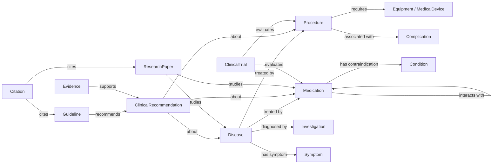
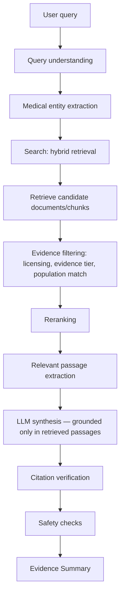
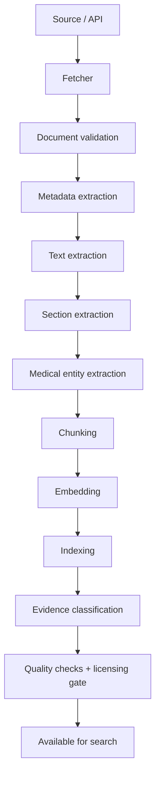
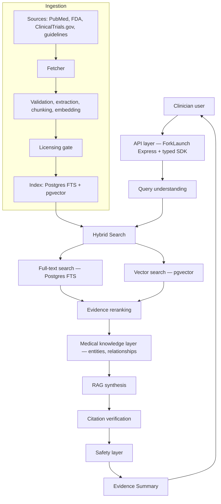

# Medical Literature Search Engine (MLSE) — Planning Document

Status: **DRAFT — planning/specification only. No implementation has started.**

This document is a specification, not an implementation. Nothing described here has been built unless the "Existing ForkLaunch Architecture" section says so explicitly and cites a real path in the repository.

## How to read this document

Every substantive statement is tagged:

| Tag | Meaning |
|---|---|
| **FACT** | Verified by reading the repository at the commit this document was written against. A path or code reference is given. |
| **ASSUMPTION** | Believed likely true but not verified against a real system (e.g. clinical workflow assumptions, adopter behavior). |
| **PROPOSAL** | A design choice being recommended. Not yet agreed, not yet built. |
| **OPEN QUESTION** | Genuinely undecided. Needs a founder/clinical/legal/engineering decision before design can proceed. |
| **RISK** | A way this could fail, be misused, or cause harm. Cross-referenced in the Risk Register (§18). |
| **TBD** | Explicitly unknown. Not guessed. |

Untagged prose is structural/explanatory text (headings, table framing) and carries no independent claim.

---

## 0. Executive Summary

**PROPOSAL.** Build a medical-literature and clinical-knowledge search engine — not a diagnostic tool, not a prescribing tool — that lets a clinician search a clinical topic ("open heart surgery", "metformin dosing in renal impairment", "post-op DVT prophylaxis") and get a structured, evidence-graded, fully-cited summary assembled from authoritative medical sources, with retrieval-augmented generation (RAG) doing synthesis on top of a strictly grounded evidence base — never on model memory alone.

**FACT.** This would be built as a new ForkLaunch **blueprint module** (`blueprint/medical-search-base/` or similar), following the exact same architectural pattern as the existing `blueprint/cac-base` (computer-assisted-coding) module: a standalone Express-based service with MikroORM persistence, DI-based service wiring, tenant-scoped multi-org data isolation, compliance-classified entities, and a typed SDK — reusing the framework's existing IAM, billing, Redis, S3, and worker infrastructure rather than inventing new plumbing for those concerns.

**OPEN QUESTION.** ForkLaunch has no existing full-text/vector search infrastructure, no existing medical-terminology licensing relationships (UMLS/SNOMED/RxNorm), and no existing frontend in this repository at all (see §1). All three are net-new work and net-new legal/licensing relationships this plan depends on. This is the single biggest scope driver in the whole document.

---

## 1. Existing ForkLaunch Architecture

This section is built entirely from reading the repository (`forklaunch-js`, branch state as of this document). It does not speculate about capabilities the repo doesn't demonstrate.

### 1.1 What ForkLaunch actually is

**FACT.** Per `README.md`: ForkLaunch is a backend framework and infrastructure platform — type-safe Express (via Zod or TypeBox schema validators), a Rust CLI that scaffolds and wires services/workers/libraries, DI-driven infrastructure (auth, DB, cache, storage, queues), auto-generated OpenAPI/AsyncAPI specs and typed client SDKs, and OpenTelemetry-based observability. It is **not** a product; it is what products are built on top of. There is no ForkLaunch "app" with a UI in this repository — this repo is the framework, CLI, and a library of reusable backend module blueprints.

### 1.2 Repository layout

**FACT.** Three top-level areas, each its own pnpm workspace (confirmed via separate `pnpm-workspace.yaml` files — this matters, see §1.7):

| Area | Contents |
|---|---|
| `framework/` | The published npm packages: `core`, `express`, `hyper-express`, `validator`, `universal-sdk`, `testing`, `internal`, `bunrun`, `ws`, `infrastructure/redis`, `infrastructure/S3` |
| `blueprint/` | Reusable backend module blueprints: `billing-base`/`billing-stripe`, `iam-base`/`iam-better-auth`, `messaging-base`/`messaging-twilio`, `ecommerce-stripe`, `cac-base`, plus `core`, `monitoring`, `client-sdk`, `interfaces/*`, `implementations/*` |
| `cli/` | A Rust CLI (`forklaunch`) that scaffolds new applications, services, workers, libraries, and "modules" (pre-built blueprints like the ones above) into a customer's own generated project |

**FACT.** `docs/learn/architecture.md` describes what a *generated* application looks like: a `src/modules/` monorepo with a shared `core` (DI registrations + RBAC), `monitoring` (OpenTelemetry config, Grafana dashboards), and `universal-sdk` package, plus a `docker-compose.yaml` running the LGTM observability stack (Loki, Grafana, Tempo, Mimir) and MinIO (S3-compatible storage).

### 1.3 Canonical module anatomy (from `blueprint/cac-base` and `blueprint/billing-base`)

**FACT.** Every blueprint module follows the same shape:

```
<module>/
├── bootstrapper.ts        # instantiates the DI container, exports { ci, tokens }
├── registrations.ts       # DI wiring: config schema, runtime deps, services
├── mikro-orm.config.ts    # MikroORM datasource config
├── server.ts              # Express app entry point
├── sdk.ts                 # typed SDK surface (MapToSdk) for client-sdk generation
├── surfacing.ts           # OpenAPI/AsyncAPI surfacing
├── domain/
│   ├── enum/
│   ├── schemas/           # Zod/TypeBox request/response schemas
│   └── types/
├── persistence/
│   ├── entities/          # MikroORM entities, compliance-classified
│   └── seed.data.ts / seeder.ts
├── migrations/            # hand-written or generated MikroORM migrations
├── api/
│   ├── controllers/       # handlers.get/post/put/delete + auth + responses
│   └── routes/
├── services/               # business logic, injected via DI
├── scripts/                # e.g. retention enforcement, data refresh jobs
└── __test__/               # vitest/jest unit + e2e (testcontainers)
```

### 1.4 Dependency injection & service wiring

**FACT.** `createConfigInjector` (from `@forklaunch/core/services`) builds a chained injector: a `configInjector` (env-driven config schema) chained into `runtimeDependencies` (DB connection, `EntityManager`, cache, encryption) chained into `serviceDependencies` (business services). Each registration declares a `Lifetime` (`Singleton` or `Scoped`) and a `factory` that destructures its dependencies by name. `bootstrapper.ts` exports `{ ci, tokens }`; controllers resolve singletons with `ci.resolve(tokens.X)` and request-scoped services with `ci.scopedResolver(tokens.X)`, called per-request as `serviceFactory({ context: {...} })`.

### 1.5 Persistence, multi-tenancy, and compliance (verified in depth via the `cac-base` PR this session)

**FACT.** Persistence is MikroORM. Entities are declared via `defineComplianceEntity` (from `@forklaunch/core/persistence`), which requires every field to carry a `compliance()` classification (`'none' | 'pii' | 'phi' | 'pci'`). Fields classified `pii`/`phi`/`pci` are backed by a MikroORM `EncryptedType` (AES-256-GCM, HKDF-derived per-tenant key via `FieldEncryptor`).

**FACT.** Multi-tenancy is enforced two ways simultaneously: (1) a MikroORM global filter (`tenantFilter.ts`, filter name `tenant`) that adds `WHERE organizationId = :tenantId` to every query on an entity that has that column, and fails **open** (no filtering) if no tenant context is set; (2) an `AsyncLocalStorage`-based encryption-tenant context (`tenantEm.ts`, `encryptedType.ts`) that determines which per-tenant key `EncryptedType` fields decrypt/encrypt under. Both must be engaged via `wrapEmWithTenantContext(em, tenantId)` on every request-scoped `EntityManager` — omitting it is a real, previously-shipped bug class in this codebase (both `billing-base` and, until this session, `cac-base`'s GDPR erase/export path had this gap).

**FACT.** A generic `ComplianceDataService` (framework/core) implements GDPR erase/export by walking all `defineComplianceEntity`-registered entities and matching a configurable per-entity `userIdField`. A `RetentionService` enforces per-entity retention policies (delete or anonymize after a duration).

**FACT.** Row-level security exists as a documented mechanism (`RlsEventSubscriber`, referenced in code comments) alongside the MikroORM filter — i.e., Postgres RLS is part of the intended defense-in-depth, not just an app-level filter.

**Implication for this project (PROPOSAL):** A medical-search module holding hospital-specific usage data (saved searches, audit logs) should use exactly this same compliance/tenancy machinery — not invent a parallel one. Pure medical-literature content (drug labels, guidelines, papers) is not tenant data and should **not** be organization-scoped or encrypted; only per-hospital usage data would be. This product never holds patient data at all (§12.1), so this machinery's PHI-grade encryption is a defensive default for incidental query context, not something the corpus itself needs.

### 1.6 Auth & RBAC

**FACT.** Two IAM modules exist: `iam-base` ("authorization only" per the CLI's own module description) provides organization/user/role/permission CRUD and JWT **verification** via a `jwksPublicKeyUrl`; `iam-better-auth` wraps the `better-auth` library, presumably for actual login/session/token issuance (not independently verified in this session — **TBD** exact responsibility split at the code level beyond the CLI's one-line description).

**FACT.** RBAC primitives live in `blueprint/core/auth/rbac.ts`: `PERMISSIONS` (`platform:read`, `platform:write`, extensible), `ROLES` (`viewer`, `editor`, `admin`, `system`), and derived permission/role sets (`PLATFORM_READ_PERMISSIONS`, `PLATFORM_SYSTEM_ROLES`, etc.) consumed by controllers as `auth: { jwt: { jwksPublicKeyUrl }, allowedRoles / allowedPermissions }`. Modules extend this with their own permission slugs (e.g. `cac-base` defines `coder:manage_claims`).

### 1.7 Framework vs. blueprint are separate release trains — a real, previously-hit constraint

**FACT, verified the hard way this session.** `framework/` and `blueprint/` are **separate pnpm workspaces**. Blueprint modules consume framework packages (`@forklaunch/core`, etc.) as **published npm dependencies**, never as a local workspace link. A change to `framework/core` source does not reach a blueprint module until that package is versioned and published to npm, and the blueprint module's `package.json` pin is bumped. This exact gap has already caused real CI breakage on the `cac-base` module twice in this repo's history (an unpublished `@forklaunch/interfaces-cac` dependency, and a published `@forklaunch/implementation-cac-base` version whose *content* didn't actually include code the blueprint depended on). **Any plan that assumes "add a capability to `framework/core` and use it immediately in the new module" is wrong** — it must go through an actual release.

### 1.8 Infrastructure primitives that already exist

**FACT.**

| Package | Purpose | Confirmed capability |
|---|---|---|
| `@forklaunch/infrastructure-redis` | Cache | `RedisTtlCache` — TTL-based cache with a `FieldEncryptor` for encrypting cached values |
| `@forklaunch/infrastructure-s3` | Object storage | S3-compatible object store client (MinIO locally, per `docker-compose.yaml`) |
| `implementations/worker/{bullmq,kafka,redis,database}` | Async job/queue backends | Four interchangeable worker backends behind a common `interfaces/worker` contract; `bullmq` implementation has typed producer/consumer schemas |
| Monitoring stack | Observability | OpenTelemetry SDK + collector, Grafana/Loki/Tempo/Mimir (LGTM) via docker-compose, a shared `metricsDefinitions.ts` pattern (`http_requests_total`, `http_request_duration_ms`, `http_errors_total`, `http_requests_in_flight`, extensible) |
| `client-sdk`, `universal-sdk` | Typed SDKs | `MapToSdk` generates a typed client SDK from a module's `sdk.ts` surface; `universal-sdk` is a runtime-agnostic SDK caller |

**FACT — explicitly what does NOT exist:**

- **No full-text search engine** (no Elasticsearch/OpenSearch/Typesense/Meilisearch anywhere in the repo).
- **No vector database or embeddings infrastructure** (no pgvector, Pinecone, Weaviate, Qdrant references).
- **No medical terminology packages or licenses** (no UMLS/SNOMED CT/RxNorm/ICD/CPT integration beyond `cac-base`'s own ICD-10-CM/HCPCS/CPT code-set tables, which are billing-coding tables, not a clinical ontology/knowledge graph).
- **No LLM/RAG infrastructure** (no existing LLM client wrapper, prompt pipeline, or citation-grounding mechanism anywhere in `framework/` or `blueprint/`).
- **No frontend of any kind** — no `apps/`, no React/Vue/Svelte anywhere in this repository. Every "frontend" reference in ForkLaunch's own docs is about a *customer's own* frontend consuming the generated typed SDK.
- **No document ingestion/ETL pipeline for external literature.** The closest analogue is `cac-base`'s `CodeSetLoaderService` (a generic batch-upsert CSV loader for ICD-10/HCPCS/CPT reference tables) — structurally similar in *shape* to what a literature ingestion pipeline needs, but built for small structured code tables, not full-text documents at scale.

### 1.9 Where this module should live, and what's reusable vs. net-new

| Component | Status |
|---|---|
| Backend framework, DI, HTTP layer, OpenAPI/SDK generation | **Reuse as-is** — this is the whole value proposition of building on ForkLaunch |
| Multi-tenant Postgres + MikroORM + compliance/encryption/retention framework | **Reuse as-is** for any hospital-specific data (saved searches, org settings, audit); **do not use** for the literature corpus itself (not tenant data) |
| Auth/RBAC (`iam-base`, `blueprint/core/auth/rbac.ts`) | **Reuse as-is**, extended with module-specific permission slugs (pattern: `clinician:search`, `reviewer:approve_source`, etc.) |
| Redis cache, S3 object storage | **Reuse as-is** — S3/MinIO for raw ingested documents (PDFs, XML), Redis for query/result caching |
| Worker backends (bullmq/kafka/redis/database) | **Reuse as-is** for the async ingestion pipeline |
| Observability (OpenTelemetry, `metricsDefinitions`) | **Reuse as-is**, extended with module-specific metrics |
| Full-text/vector search | **Net-new infrastructure** — no existing package; needs a new `infrastructure/*` package (mirroring the `redis`/`S3` pattern) or a managed external service |
| Medical terminology (UMLS/SNOMED/RxNorm) | **Net-new licensing relationship** — nothing in this repo |
| LLM/RAG pipeline | **Net-new** — no existing LLM client, prompt orchestration, or citation-verification code anywhere in the framework |
| Frontend | **Net-new, and arguably out of scope for this repo** — would be a separate consumer application using the generated typed SDK, not something added to `forklaunch-js` itself |

### 1.10 Open questions from the architecture review

- **OPEN QUESTION:** Should this live as a single new blueprint module (`medical-search-base`), or be split (e.g. `medical-corpus-base` for ingestion/storage + `medical-search-base` for query/RAG), the way `cac-base` is one module but `billing` is split into `billing-base`/`billing-stripe` (hooks vs. provider implementation)? See §17 for a recommendation.
- **OPEN QUESTION:** Is a customer-facing frontend even in scope for this initiative, or is the deliverable an API + SDK that hospitals' own frontends (or a separate ForkLaunch product) consume? This changes the entire Frontend section (§11) from "build it" to "design the SDK surface it will need."

---

## 2. Product Vision

**PROPOSAL** (restating and sharpening the brief). A clinician searches a clinical topic and receives a structured, evidence-graded synthesis — not a list of links, not a chatbot answer from model memory. Example query: `"open heart surgery"`.

**Confirmed product direction:** the retrieval/search foundation underneath that answer is modeled directly on PubMed — concept-level indexing, field-specific search, filters, citation relatedness (§8.1) — not a generic RAG-chunking search bar. The AI-synthesized answer stays the product's core value-add; PubMed-grade search is the foundation it's built on, not a replacement for it.

**Confirmed product direction — the "Google, but for medicine" result page.** The bar is the Google search-results experience: search `liver transplant`, and the answer is comprehensive **on the same screen**, not scattered across links the doctor has to open one by one. Concretely, per the confirmed brief: why the condition happens (causes/pathophysiology, §6.1), what tests should be done (investigations, §6.1/§6.2), and — for a procedure — the full surgical process end to end, from indication through recovery (§6.2). A surgeon should be able to pull up MLSE mid-workup and get the whole picture at a glance, the way a Google results page answers "how do I..." in one view rather than sending the searcher hunting across ten tabs. This is not new scope — §6.1/§6.2's entity schemas already cover exactly this list of fields — but it is the concrete experience bar every result page (§10) has to clear, and it's restated here because it's the product's defining comparison, not an incidental detail.

Structured result sections (per query type — see §5 for the full per-entity-type schema):

Overview · Definition · Indications · Contraindications · Patient preparation · Pre-operative evaluation · Procedure/workflow · Equipment · Anesthesia considerations · Medications · Typical duration · ICU/hospital considerations · Post-operative management · Follow-up · Complications · Relevant guidelines · Relevant research papers · Clinical trials · Evidence quality · Sources/citations.

**Non-negotiable, product-defining constraint:** every substantive medical claim in the output must be traceable to a specific cited source passage. An unsupported sentence is a defect, not a stylistic nitpick — see §9 (Evidence System) and §10 (AI/RAG) for the mechanism, and §12 (Safety Architecture) for what happens when that mechanism fails.

### 2.1 Competitive Landscape — why this, not an existing tool

**ASSUMPTION, not independently verified this session.** The characterizations below are general market awareness, not a hands-on competitive audit — flagged explicitly because a plan that skips this question entirely is answering "can we build this" without ever asking "should we, given what already exists."

| Existing tool | What it does (general understanding) | Where this plan's vision differs, or the gap it leaves |
|---|---|---|
| UpToDate (Wolters Kluwer) | Editorially-written, expert-authored point-of-care topic summaries — the incumbent most hospitals already pay for | Human-edited on a slow update cycle, not a live literature search engine; its citation trail is to the editors' own review process, not a queryable evidence graph over new papers/trials as they publish. This plan's differentiation is live, source-traceable synthesis over a broader, continuously-updated corpus — not a faster-updating encyclopedia. |
| OpenEvidence | An AI-native, citation-linked medical Q&A tool already positioned close to this plan's vision | **The closest existing competitor by concept**, as far as general awareness goes. If accurate, the differentiation this plan would need is either a narrower wedge (e.g. the structured procedure/surgery pages in §6.2, which general medical-Q&A tools don't specialize in) or a distribution advantage — bundled into a hospital's existing ForkLaunch-based systems (alongside `cac-base`, `billing-base`, `iam-base`) rather than sold as a standalone subscription tool. |
| Elicit, Consensus.app | General-purpose AI research-paper search/summarization, not medicine-specific | No clinical safety boundary (§3's category A–D split), no evidence grading for clinical practice, no medical entity/knowledge-graph layer (§7). The gap they leave is a clinician-safe, clinically-structured product — not raw paper search with a nicer UI. |
| PubMed / Google Scholar directly | The underlying literature index this whole system sits on top of — and, per product direction, the explicit reference model for the retrieval layer's own capabilities (§8.1: MeSH-style indexing, field-specific search, filters, citation relatedness) | Zero synthesis, zero evidence grading, zero structured disease/procedure/medication pages. We are building our own PubMed-caliber search/indexing engine over a curated corpus (§8.1) — not just querying real PubMed as an external API — with the synthesis/safety/structure layer (§9-§11) on top of it. |

**OPEN QUESTION, and arguably the most consequential one added in this revision:** none of the above was verified against these products' actual current capabilities in this session — this table is market awareness, not a competitive audit. Before this document is used externally (with a founder, an investor, or a clinical partner), someone should actually run a handful of real clinical queries through OpenEvidence and UpToDate and compare outputs directly against §10's example UX. If a tool like OpenEvidence already does most of what §2–§11 describe, the real strategic question stops being "should we build this" and becomes "what does building it on ForkLaunch's existing hospital-infrastructure relationships (IAM, billing, the CAC precedent, §1) let us do that a standalone competitor can't" — i.e., a distribution/bundling advantage, not a novel feature set. That reframing changes the MVP (§21): it would shift toward proving the bundled-distribution thesis with an existing ForkLaunch hospital customer, rather than proving the synthesis technology in the abstract.

### 2.2 Desk research (Sept 2026): what the market does, and where "best" is still open

**FACT, from published sources (desk research, not yet hands-on testing, so the §2.1 audit is still needed):**

| Finding | Source | What it means for MLSE |
|---|---|---|
| OpenEvidence has content deals with NEJM, JAMA plus 11 JAMA specialty journals, NCCN, ACC, AAOS and 300+ journals, and reports 100% on USMLE-style questions. It offers a fast mode (seconds, ~5 refs) and "Deep Consult" (minutes, ~34 refs). | [Doody's review](https://dcdm.doody.com/2026/05/a-review-of-openevidence/), [Fierce Healthcare](https://www.fiercehealthcare.com/ai-and-machine-learning/openevidence-ai-scores-100-usmle-company-offers-free-explanation-model) | Its edge is **licensed content**, not the AI. We can't match that corpus at launch, so we compete on structure, honesty, and distribution. |
| On 100 hard subspecialty cases (MedXpertQA), OpenEvidence got **31–34%** (fast) and **38–41%** (Deep Consult). More references did not mean better accuracy, and **neither mode ever said "I don't know."** | [medRxiv preprint, Nov 2025](https://www.medrxiv.org/content/10.64898/2025.11.29.25341091v1.full) | The clearest open gap: **calibrated honesty**. A tool that says "evidence insufficient" when it doesn't know is better for a surgeon than one that is confidently wrong. |
| UpToDate Expert AI (launched Oct 2025) answers **only from UpToDate's own edited corpus**, showing assumptions, step-by-step reasoning, and one-click links to the topic. | [Wolters Kluwer](https://www.wolterskluwer.com/en/news/uptodate-expert-ai-genai-clinical-decision-support), [STAT](https://www.statnews.com/2025/10/02/uptodate-artificial-intelligence-openevidence-clinical-decision-chatbot/) | Confirms the design in §9: a closed, curated corpus plus visible reasoning is what the incumbent chose for trust. |
| In a RAG chatbot, hallucination rose from **5% to 40%** after 10 turns of conversation, because the retriever started searching on the chat history instead of the current question. | [npj Health Systems, 2026](https://pmc.ncbi.nlm.nih.gov/articles/PMC13354189/) | Follow-up questions ("and what about in children?") must re-retrieve on a rewritten standalone question, never on raw chat history (§9.6). |
| Across 12 RAG designs, hybrid retrieval (keyword BM25 + dense embeddings + a cross-encoder re-ranker) retrieved best, and **self-reflective RAG** (the model checks its own draft against sources and re-retrieves) had the lowest hallucination rate, **5.8%**. | [Electronics, Oct 2025](https://doi.org/10.3390/electronics14214227) | Adopt hybrid retrieval + re-ranking (§8) and a check-and-retry loop before the §9.2 citation checks. |
| MedRAG/MIRAGE benchmark: RAG raised medical QA accuracy by up to 18%. **PubMed was the most robust single corpus**; textbooks helped most on exam-style questions. | [ACL Findings 2024](https://aclanthology.org/2024.findings-acl.372/) | Supports §8.1's PubMed-first retrieval, with textbooks as the source for procedural detail (§6.2). |
| Reviews comparing RAG with fine-tuning find RAG better for medical facts; fine-tuning facts into a model raises "hallucination via overfitting." | [Systematic review](https://www.authorea.com/doi/full/10.22541/au.176903295.54191070/v1), [Ovadia et al.](https://ar5iv.labs.arxiv.org/html/2312.05934) | **We do not train medical knowledge into a model.** Knowledge lives in the corpus; training is limited to small helper models (§9.7). |
| HealthBench: 5,000 conversations graded with 48,000+ rubric items written by 262 physicians, scoring accuracy, completeness, context-seeking, and hedging. | [HealthBench Professional](https://cdn.openai.com/dd128428-0184-4e25-b155-3a7686c7d744/HealthBench-Professional.pdf) | The model for our eval set (§9.5): per-topic, physician-written rubrics, not just "right answer / wrong answer." |

**Platforms like ours, as of Sept 2026 (FACT from published sources):**

| Platform | What it is | Content base | Where MLSE differs |
|---|---|---|---|
| **OpenEvidence** | AI medical search, free for US clinicians | NEJM, JAMA family, NCCN, 300+ journals, FDA/CDC | Closest overall. No structured surgery walkthroughs; didn't say "I don't know" in testing (above) |
| **UpToDate Expert AI** (Wolters Kluwer) | AI mode on the incumbent point-of-care reference | UpToDate's edited topics only | Closed, slow-updating corpus; paid hospital subscription |
| **ClinicalKey AI** (Elsevier) | AI answers with citations, in 50+ countries, API integration available | Elsevier journals and textbooks (Lancet, Braunwald, Goldman-Cecil, Nelson) and more ([Elsevier](https://www.elsevier.com/products/clinicalkey/clinicalkey-ai)) | Owns the textbooks we would need to license; it accepts patient context, which we deliberately don't |
| **DynaMed Dyna AI Mode** (EBSCO) | AI mode on DynaMed, launched Feb 2026, shows reasoning and evidence ([EBSCO](https://about.ebsco.com/news-center/press-releases/ebsco-clinical-decisions-launches-dyna-ai-mode)) | DynaMed's edited content | Same model as UpToDate: closed, editorial corpus |
| **Doximity GPT** (with Pathway, acquired 2025 for up to $63M) | Free AI answers inside the Doximity physician network, 300k+ clinician users | Guidelines, drugs, journals, landmark trials across 39 specialties ([CNBC](https://www.cnbc.com/2025/08/07/doximity-acquires-ai-startup-pathway-medical-for-63-million.html)) | Distribution through a doctor network; general Q&A, not procedure-deep |
| **Touch Surgery / Touch Surgery Aide** (Medtronic) | Surgical training plus real-time OR AI on video ([Medtronic, Jul 2026](https://news.medtronic.com/2026-07-21-A-new-era-for-surgery-with-real-time-AI-Medtronic-to-unveil-Touch-Surgery-TM-Aide,-the-next-generation-compute-platform-for-the-operating-room-at-Society-of-Robotic-Surgery-2026)) | Surgical video, device data | Tied to Medtronic hardware and video; not literature search |
| **GoSurgery** | Step-by-step standardized procedure workflows with tips and warnings, shown per step on a pedal-controlled tablet in the OR ([PMC review](https://pmc.ncbi.nlm.nih.gov/articles/PMC13283024/)) | Workflows written by surgeons/hospitals | **Closest to our surgery page (§6.2)**, but authored workflows, not a literature search with citations |
| **WebSurg** (IRCAD) | Free surgical video university, 4,000+ videos, 480k members ([IRCAD](https://www.ircad.fr/e-learning/websurg-online-university/)) | Expert surgical videos | Video learning, no AI search or evidence synthesis. **A possible content partner** |
| **Elicit, Consensus** | AI research-paper search | Open papers | Not clinical, no safety layer |

**Conclusion.** General AI medical Q&A is crowded, with big publishers (Wolters Kluwer, Elsevier, EBSCO) and well-funded startups (OpenEvidence, Doximity/Pathway). Nobody found combines **(a)** literature search with sources, **(b)** a structured, phase-by-phase surgical walkthrough, and **(c)** case-report evidence for rare complications. The surgery-focused tools (GoSurgery, Touch Surgery, WebSurg) are workflow, video, or hardware products, not evidence search. MLSE is for **all doctors** (§2), and it competes on completeness and honesty across every topic. The evidence-backed surgery reference (§6.2, §4.0) is its **standout feature**: the part no competitor covers, and the most defensible reason to choose MLSE.

### 2.3 User research from secondary data (surveys and studies, Sept 2026)

**Context:** the team has no surgeon contacts yet, so this section collects what surgeons and physicians have already reported in published research. It replaces nothing: interviews with real surgeons (§2.1) are still needed before launch. But it grounds the product in evidence instead of assumptions.

| What the research says | Source | What it means for MLSE |
|---|---|---|
| Surgical residents prepare for cases by reviewing imaging (89%), **watching surgical videos (84%)** and reviewing records (82%). Reading articles is less common but **strongly linked to feeling prepared**. The main barrier is **limited time and energy**. | [Lari et al. 2025, 201 residents, multinational](https://pmc.ncbi.nlm.nih.gov/articles/PMC11851091/) | Surgeons will read evidence if it's fast. Phase-by-phase, one-line-first pages (§6.2) match the time barrier. Linking to vetted videos per step is a strong feature. |
| **YouTube is the most used case-prep platform** for surgical trainees, but video quality is often poor, commentary rare, and juniors rate videos higher than attendings do. Authors call for vetting. | [Attending guidance advised, Surg Endosc](https://link.springer.com/article/10.1007/s00464-021-08751-0), [PMC9996672](https://pmc.ncbi.nlm.nih.gov/articles/PMC9996672/) | A **vetted, sourced alternative to YouTube** for case prep is a clear, underserved need. Partner with WebSurg (§2.2) for video instead of linking random videos. |
| General LLMs score 73–87% on surgical board questions but do **consistently worse on surgical technique items**. Authors warn against using them for procedural instruction without oversight. | [ABSITE study 2025](https://pubmed.ncbi.nlm.nih.gov/41108691/), [Surgical subspecialty boards 2025](https://pmc.ncbi.nlm.nih.gov/articles/PMC13342517/) | Operative technique is the weakest area for AI, which is exactly why §6.2 steps must come from licensed sources, never from model memory. It's also the gap competitors have. |
| Clinicians raise about **0.57 questions per patient** and pursue only about half. **Lack of time** and doubt that an answer exists are the main barriers. 34% of questions are about drug treatment. | [Systematic review, JAMA Intern Med](https://pubmed.ncbi.nlm.nih.gov/24663331/), [Unanswered clinical questions survey](https://pmc.ncbi.nlm.nih.gov/articles/PMC5234458/) | Speed is the product. Target a first useful answer in seconds (like OpenEvidence's fast mode), with depth on demand. |
| **81% of US physicians use AI** professionally (AMA 2026, up from 38% in 2023). **~65% of US doctors used OpenEvidence** in April 2026, across ~27M clinical encounters. OpenEvidence raised $250M in Jan 2026. | [NBC News](https://www.nbcnews.com/tech/tech-news/openevidence-ai-doctor-medical-physician-login-app-what-npi-uptodate-rcna341064), [Becker's](https://www.beckershospitalreview.com/healthcare-information-technology/ai/openevidence-6-things-to-know-about-the-ai-tool-used-by-half-of-physicians/), [BusinessWire](https://www.businesswire.com/news/home/20260121029132/en/OpenEvidence-Raises-%24250-Million-to-Build-Medical-...) | Doctors already accept AI search, so no market education is needed. But **OpenEvidence is the default**, so MLSE must be clearly better at one thing (surgery), not a general alternative. |
| Users report OpenEvidence makes enough mistakes that they **must read sources and double-check**. Its free tier is the main reason people adopted it. | [MedAI Verdict review](https://medaiverdict.com/tools/openevidence) | Mechanical citation checks and "insufficient evidence" (§9.2, §11.1) answer a real complaint. Pricing must compete with free, so hospital bundling (§2.1) matters. |
| Physicians' top AI concerns are **liability for errors (83%)** and **lack of transparency (76%)**. Trust is higher when AI supports decisions rather than making them. | [JMIR 2025 mixed-methods study](https://pmc.ncbi.nlm.nih.gov/articles/PMC12421205/) | Confirms §3: show sources and reasoning, never recommend for a specific patient. "Every number has a source" is a selling point, not just a safety feature. |

**Draft user personas (to be validated in interviews).** MLSE serves all doctors. (1) **Any clinician at the point of care**: a physician with a question between patients, who has minutes, not hours, and wants a complete, sourced answer (drug, disease, workup, treatment). (2) **The surgeon, for procedure pages**: a surgical resident or attending preparing the night before, or minutes before, a case. They have 5–15 minutes, currently use YouTube plus memory, and want to know the steps, danger points, expected blood loss, and what can go wrong. They don't trust AI without seeing the source.

**PROPOSAL — what would make MLSE the best, based on the above:**

1. **Complete by design.** Every topic answers a fixed, clinician-approved set of questions (what / why / who / when / how / risks / after / outcomes, §9.6), and the page shows which ones the evidence couldn't answer. Competitors return a chat paragraph; we return the whole picture on one screen (§2).
2. **Honest about what it doesn't know.** "Insufficient evidence" is a first-class answer (§11.1). This is the gap the OpenEvidence study found.
3. **Every number checked against its source.** Doses, blood loss, and rates are typed values tied to a citation (§6.2), checked mechanically (§9.2), not free text.
4. **Procedure depth.** The phase-ordered surgical walkthrough (§6.2) is a specialty no general Q&A tool focuses on.
5. **Fresh.** Continuous ingestion and staleness flags (§9.3) versus UpToDate's editorial cycle.
6. **Built into the hospital's existing systems** (IAM, billing, CAC), which a standalone app can't offer (§2.1).

"All answers correct" is the goal, but no published system reaches 100%, including those above. The engineering target is therefore **never wrong silently**: every claim is sourced and checked, and when evidence is missing or conflicting, the page says so.

---

## 3. Core Principle: What This System Is and Is Not

**PROPOSAL.** The system answers *"what does the medical literature and authoritative evidence say?"* It is explicitly **not** an autonomous clinical decision-maker. Four categories, with sharply different regulatory exposure:

| Category | What it does | Regulatory posture | In scope? |
|---|---|---|---|
| **A. Medical literature / evidence retrieval** | Finds and returns real documents (guidelines, papers, drug labels) with full provenance | Lowest risk — functionally a specialized search engine over public/licensed medical literature | **Yes — this is the product** |
| **B. AI-generated evidence summary** | Synthesizes retrieved passages into a structured summary, every claim cited back to A | Moderate risk — accuracy of *synthesis*, not of clinical judgment; must never introduce claims not present in A | **Yes — this is the product's value-add over raw search** |
| **C. Clinical decision support (CDS)** | Recommends a course of action for a specific patient situation, evaluates patient-specific data against a rule/model | High regulatory risk — in the US, software that provides patient-specific diagnostic/treatment recommendations without letting the clinician independently review the basis may be regulated as a medical device (FDA's CDS software guidance, 21st Century Cures Act criteria) | **No — explicitly out of scope for this system** |
| **D. Patient-specific treatment / prescribing** | Determines an actual dose, treatment plan, or prescription for a named patient | Practicing medicine — requires a licensed clinician and, in most jurisdictions, is not something software does at all | **No — never in scope** |

**PROPOSAL — the enforcement mechanism, not just a policy statement:** the system must be **structurally** incapable of producing C/D-shaped output, not merely instructed not to. Concretely:

- The system never accepts or stores patient-identifying context as a search input, in any phase — a permanent product boundary, not an MVP-only restriction (§12.1).
- Medication results (§5.3) present *drug-label-level* information (indication, standard dosing ranges *as published in the label/guideline*, contraindications, interactions) — never "give patient X 500mg of Y." A dosing range from an FDA label ("500–1000mg every 8 hours for adults with normal renal function") is category A/B (it's a citation of a real document). "This patient should take 500mg" is category D and must be refused/redirected (§12).
- Any query that is detected as asking for D-shaped output (see §12.4 for detection heuristics) gets a structured refusal explaining the boundary, not a best-effort answer.

**OPEN QUESTION:** Where exactly the FDA would draw the CDS line for *this specific* product needs actual regulatory counsel, not an engineering guess — flagged again in §14.

---

## 4. Source Strategy

**PROPOSAL.** A source-hierarchy table. Values under "Evidence level," "Indexable," "Quotable," and "AI-summarizable" are **PROPOSAL** defaults pending legal review, not settled policy — see the licensing subsection immediately after.

| Source type | Example | Authority | Typical evidence level | Update frequency | Indexable? | Quotable (short excerpt)? | Usable for AI summary? |
|---|---|---|---|---|---|---|---|
| Clinical practice guideline | professional society guidelines (e.g. AHA/ACC, WHO) | High — consensus of a recognized body | Guideline (graded internally, e.g. Class I/IIa/IIb/III + Level A/B/C) | Periodic (years) | **PROPOSAL: yes**, metadata + structured recommendations | Yes, short excerpts with attribution | Yes — primary synthesis source |
| Government/regulatory (FDA, CDC, WHO, NIH/NLM) | FDA drug label, CDC guidance | Highest for regulatory facts (approved indication, label warnings) | Regulatory/official | Ongoing, versioned | Yes | Yes | Yes |
| ClinicalTrials.gov | trial registration + (if available) results | Registry of record | Trial design/status, not itself "evidence" of efficacy until results/publication | Continuous | Yes (public API) | Yes | Yes, with clear "trial in progress" vs. "results reported" distinction |
| Systematic review / meta-analysis | Cochrane, PubMed-indexed reviews | High — aggregates primary studies | Systematic review/meta-analysis | Periodic | **Depends on license** — see below | Depends on license | Depends on license |
| RCT | PubMed-indexed trial | Primary evidence | RCT | One-time (+ corrections/retractions) | Depends on license | Depends on license | Depends on license |
| Observational/cohort study | PubMed-indexed | Primary evidence, weaker causal claim | Cohort/case-control | One-time | Depends on license | Depends on license | Depends on license |
| Case report | PubMed-indexed | Lowest primary-evidence tier | Case report | One-time | Depends on license | Depends on license | Depends on license, with explicit low-evidence flagging |
| Approved drug labeling | FDA label (DailyMed/openFDA) | Regulatory/authoritative for the drug | Regulatory | Versioned (label updates, safety communications) | Yes (public domain in the US via DailyMed/openFDA) | Yes | Yes |
| Medical textbook | e.g. a licensed reference work | High, but secondary | Textbook/reference | Rare (editions) | **No, unless licensed** | **No, unless licensed** | **No, unless licensed** |
| Institutional/hospital protocol | a specific hospital's internal protocol | Local, not generalizable | Institutional policy | Ad hoc | Only if the adopting hospital explicitly supplies it, org-scoped, not shared cross-tenant | Org-scoped only | Org-scoped only, clearly labeled as "your institution's protocol," never blended with general literature without a label |

### 4.0 Case reports and case series — a deliberate source, not just the bottom tier

**PROPOSAL, per product direction to gather data from many case studies.** Case reports are the lowest evidence tier (§5.2), but they are the *only* evidence for some things surgeons need: rare diseases, rare complications and adverse events, unusual anatomy, and outcomes of new surgical techniques. PubMed indexes over 2.4 million case reports, about 15% of all publications ([Case Report Nuggets, medRxiv 2025](https://www.medrxiv.org/content/10.1101/2025.11.13.25340162.full.pdf)). Detecting an event seen in 1 of 1,000+ patients would need a study of 3,000+ subjects, so case reports often catch these first ([PMC2992908](https://www.ncbi.nlm.nih.gov/pmc/articles/PMC2992908/)).

- **Where to get them legally:** the **PMC Open Access Subset** (3.4M+ articles under Creative Commons licenses that allow text mining, including many case reports; bulk download via the [AWS Open Data registry](https://registry.opendata.aws/ncbi-pmc/)); open-access case journals under CC BY (e.g. *Journal of Medical Case Reports*, *Cureus*: verify each journal's license at ingestion); and PubMed abstracts for everything else. Subscription journals such as *BMJ Case Reports* need a license (§4.1).
- **Extract them into a structure, not just text:** patient group (age band, sex, key condition, with no personal details carried over), presentation, procedure/intervention, what happened (complication, unusual finding), management, and outcome. Case reports follow the CARE reporting guideline ([care-statement.org](https://www.care-statement.org/case-reports)), which makes this extraction regular. Benchmarks exist to test it ([CaseReportBench](https://arxiv.org/pdf/2505.17265)).
- **How answers use them:**
  - **Case studies are an information source, not just a list (per product direction, 2026-09-23).** For every query, related case reports/series are retrieved alongside other evidence (relevance = MeSH match on the topic and, where known, the diagnosis, plus the retrieval score; weak matches discarded). Their extracted fields (presentation, diagnosis and investigations, technique variations, complications, management, outcome) feed into the matching answer sections as evidence records with `evidence_tier = case_report`, e.g. a rare complication and its management under *Complications*, or a technique variation under the relevant operative step, labelled "from published case reports." They rank below guidelines/trials, never override them, and never produce rates. They pass through the same citation and number verification as any other evidence (§9.2).
  - **Case studies by diagnosis (per product direction, 2026-09-23).** Every procedure page (§6.2) includes a *Case studies* section: published case reports and case series for that procedure, **grouped by the diagnosis that led to surgery** (e.g. for laparoscopic cholecystectomy: acute cholecystitis, gallstone pancreatitis, Mirizzi syndrome, gallbladder polyp). Each case card shows presentation → diagnosis and investigations → procedure (approach, key findings, complications) → outcome, with the source link. Cases are found via PubMed's "Case Reports" publication type and MeSH tags for the procedure and diagnosis, with full text only from commercially reusable PMC OA articles (§4.1).
  - A procedure page (§6.2) gets a **"Reported rare complications / case experience"** block ("12 published case reports describe X after this procedure [refs]").
  - A **case-series view** groups similar cases so a surgeon sees the pattern, not one anecdote.
  - They are **always labelled "case report, low evidence"**, never used for incidence rates or treatment recommendations when higher-tier evidence exists, and never override a guideline (§5.3).
- **Boundary check (§12.1):** case reports are published, de-identified literature, so they stay inside the "no patient data" boundary. MLSE stores what the journal published, never extra patient details, and it never matches a user's own patient against cases.

### 4.1 Licensing and copyright — first-class requirement, not a footnote

**RISK.** *"Publicly accessible" does not mean "legally indexable, quotable, or AI-summarizable."* This is the single most likely way this project creates real legal exposure, and it is easy to get subtly wrong (e.g., PubMed's own abstracts are generally reusable per NLM's policies, but the **full text** of a paper indexed by PubMed is very often under a publisher's copyright and NOT freely reusable, even though the abstract is).

**PROPOSAL — required per-source-type due diligence before any ingestion, not after:**

| Question | Must answer before ingesting a source type |
|---|---|
| Is the content itself public domain (e.g., US government works — FDA labels, CDC/NIH publications) or under an open license (e.g., CC-BY)? | TBD per source, tracked in a source registry (§7) |
| Does the source's API Terms of Service permit programmatic bulk retrieval and redistribution of full text, or only metadata/abstracts? | TBD per source |
| If full text is copyrighted, can we index/store only metadata + a short fair-use excerpt, with a link-through to the original for the full text? | **PROPOSAL: default posture** — store full text only where explicitly licensed; otherwise store metadata + a short excerpt (a few sentences, with clear provenance) and link out |
| Do we need a data-use or API agreement with the publisher/aggregator (e.g., PubMed Central's different license tiers per article)? | TBD, needs a real licensing review, not an engineering assumption |
| Does the terminology system itself require a license to use at all (UMLS, SNOMED CT, RxNorm all require a UMLS Metathesaurus license/affiliate agreement; ICD-10-CM/CPT — the same categories `cac-base` already had to reason about for coding, see `plan/cac/MEDICAL-CODING-IMPLEMENTATION-PLAN.md`) | **FACT:** `cac-base`'s plan doc already establishes CPT requires an AMA license per adopting organization, held by *them*, not by ForkLaunch. The same reasoning likely applies to UMLS/SNOMED/RxNorm here — **OPEN QUESTION** whether this product licenses them centrally (as ForkLaunch, for its own literature corpus) or requires each adopting hospital to hold its own license, mirroring the CAC precedent. |

**RISK:** Bulk-copying full-text journal articles into a proprietary index without a license is a real, expensive legal exposure (publisher litigation precedent exists in this space). Treat every non-government, non-explicitly-open-licensed source as **metadata + abstract + short excerpt + link-out** until a licensing agreement says otherwise. This is a hard default, not a suggestion.

---

## 5. Evidence System

### 5.1 Evidence record — required fields

**PROPOSAL** schema (conceptual, not yet a database DDL — see §15 for that):

| Field | Purpose |
|---|---|
| `source_id` | FK to the source registry (§4) |
| `document_id` | FK to the ingested document |
| `title` | |
| `authors_or_organization` | |
| `publication_date` | |
| `last_updated_date` | nullable — guidelines/labels get updated in place |
| `source_type` | enum: guideline / regulatory / systematic_review / rct / cohort / case_report / trial_registry / textbook / institutional_protocol |
| `evidence_type` | the internal grading, distinct from source_type (a guideline can cite Level A or Level C evidence internally) |
| `relevant_population` | free text + structured tags (age range, condition, comorbidities) where extractable |
| `citation` | formatted citation string |
| `identifier` | DOI / PMID / NCT number / FDA application number, as applicable |
| `passage` | the specific chunk actually used to support a claim — never a whole-document citation for a specific claim |
| `confidence_or_quality_metadata` | e.g. GRADE rating if the source publishes one, or an internally computed quality score (see below) |

**PROPOSAL, hard rule:** the AI must never invent a citation. Every citation returned to a user must resolve to a real `evidence_id` that exists in the database and was actually retrieved for that query — enforced technically in §10.4 (citation verification), not just by prompting.

### 5.2 Evidence ranking

**PROPOSAL** default hierarchy (not a fixed law — see caveat below):

1. Clinical practice guidelines (from a recognized professional body)
2. Government/regulatory sources (FDA, CDC, WHO) for regulatory facts
3. Systematic reviews / meta-analyses
4. RCTs
5. Cohort / observational studies
6. Case reports
7. Other (textbooks, institutional protocols — clearly labeled as such)

**ASSUMPTION, explicitly flagged per the brief's own instruction not to over-trust this hierarchy:** this ordering is a reasonable *default* for "what is the standard of care for X," but it is not universally correct:

- For a **rare disease or an emerging therapy**, there may be no guideline and no RCT yet — a well-conducted cohort study or even case-series may be the *best available* evidence, and should be surfaced as such (clearly labeled "limited evidence — no RCT/guideline available") rather than omitted because it's "low tier."
- For a **factual regulatory question** ("is this drug approved for pediatric use"), the FDA label outranks everything else regardless of guideline recency.
- For a **rapidly evolving area** (e.g. a drug with a recent black-box warning), the most recent regulatory safety communication should outrank an older, higher-tier but now-outdated guideline.

**PROPOSAL:** the ranking function should take the clinical question type as a parameter, not apply one static sort order to every result set. Concretely: "what is recommended treatment" queries → guideline-first; "is this approved/safe" queries → regulatory-first; "what does research show for X" queries → evidence-type ranking with recency as a tiebreaker within tier.

### 5.3 Conflicting evidence

**PROPOSAL, hard requirement:** when two credible sources disagree (e.g., an older guideline still says X, a newer RCT suggests Y, and no updated guideline exists yet), the system must **surface the disagreement explicitly** — never silently pick one side or blend them into an averaged claim. UX treatment in §11.

---

## 6. Medical Document Model

Five canonical structured entity types, each a **PROPOSAL** schema for what a fully-resolved answer page contains. These are described as domain shapes here; §14 gives a possible DB realization.

### 6.1 Disease / Condition

Definition · Epidemiology · Causes · Risk factors · Pathophysiology · Symptoms · Signs · Diagnosis · Differential diagnosis · Investigations · Treatment (overview) · Medications (list, cross-referenced to §6.3) · Procedures (list, cross-referenced to §6.2) · Complications · Prognosis · Prevention · Follow-up · Guidelines (citations) · References.

### 6.2 Procedure / Surgery

Definition · Indications · Contraindications · Patient selection · Pre-operative preparation · Investigations · Equipment · Personnel · Anesthesia · Procedure steps · Typical duration · Intraoperative considerations · Complications · Postoperative care · ICU care · Medications · Follow-up · Recovery · Evidence · References.

**PROPOSAL — the procedure page is an ordered, end-to-end operative walkthrough, not a list of headings.** Per product direction, a surgeon opening a procedure page should see the whole operation in the order it actually happens: how it starts, what is cut and how much, how much blood to expect and prepare, what anesthesia is used and in what amounts, and how it ends. `Procedure steps` above is therefore not a single free-text field. It is a structured, phase-ordered sequence, and the quantitative fields inside it are typed values with a source attached, not prose.

**Phase-ordered structure** (each phase is a list of ordered steps; every step and every number carries its own citation(s) per §9.1):

| # | Phase | What it must contain |
|---|---|---|
| 1 | **Pre-operative preparation** | Required investigations (labs, imaging, cardiac/pulmonary workup) · fasting · consent elements · pre-op medications (e.g. antibiotic prophylaxis timing, anticoagulation hold/bridging *as published*) · **blood preparation**: group-and-screen vs. crossmatch, number of units typically crossmatched for this procedure per published maximum surgical blood ordering schedules (MSBOS) |
| 2 | **Anesthesia** | Anesthesia type(s) used for this procedure (general / regional / neuraxial / sedation, and when each is used) · airway approach · induction, maintenance, and neuromuscular-blockade agents commonly used, with **label-published dose ranges** (e.g. mg/kg for a labeled population, per §6.3) · monitoring lines (arterial line, central line, TEE, etc.) · anticipated duration of anesthesia |
| 3 | **Positioning & preparation** | Patient position · padding/pressure points · skin prep · draping · time-out / safety checklist |
| 4 | **Access (how it starts)** | Approach (open / laparoscopic / robotic / endoscopic) · **incision**: anatomical location, orientation, and typical length range · tissue layers divided, in order (e.g. skin → subcutaneous fat → fascia → muscle → peritoneum) · port placement for minimally invasive approaches · retractor setup |
| 5 | **Core operative steps** | The numbered step-by-step sequence of the operation itself · **what is cut, removed, or reconstructed**: structures divided, vessels ligated/clamped, extent of resection (e.g. which liver segments, how many cm of bowel, margin targets as published) · anastomoses/implants · key "danger point" structures to identify and protect at each step · decision points where the published technique branches (e.g. conversion from laparoscopic to open) |
| 6 | **Intra-operative blood management** | **Expected blood loss (EBL)** as published ranges for this procedure/approach · published transfusion rates (% of patients transfused, typical units) · transfusion triggers used in the cited guidelines · cell salvage / antifibrinolytic use (e.g. tranexamic acid, label/guideline dosing) · massive-transfusion considerations where relevant |
| 7 | **Closure (how it ends)** | Hemostasis check · drains (type, number, placement) · counts · layer-by-layer closure (suture types as published) · dressing |
| 8 | **Emergence & immediate post-op** | Reversal/extubation · PACU vs. direct ICU transfer criteria · analgesia plan (multimodal, regional blocks) |
| 9 | **Post-operative course & recovery** | ICU/ward care · early complications to watch for, with published incidence · drain/line removal timing · diet and mobilization milestones · typical length of stay · discharge criteria · follow-up schedule · return to normal activity |

**Every number is a sourced range, never a computed value — this is where §3's boundary does the most work.** Blood loss, units to crossmatch, anesthesia drug doses, incision lengths, operative time, and length of stay vary a lot by patient, technique, and institution. Each quantitative field is therefore stored as a typed value object, not a sentence:

```
QuantitativeFact {
  value_range      // e.g. { min: 300, max: 800, unit: "mL" } or { min: 1, max: 2, unit: "mg/kg" }
  statistic        // median | mean ± SD | IQR | range | label-recommended range
  population       // e.g. "adults, elective, normal renal function" (§9.1 relevant_population)
  technique        // e.g. "open" vs "laparoscopic" — ranges are never merged across techniques
  citation_ids     // at least one, verified per §9.2
  evidence_tier    // §5.2
}
```

What that means in practice:

- **Anesthesia doses are always label/guideline ranges per labeled population** (e.g. "propofol induction 1.5–2.5 mg/kg in healthy adults <55 per FDA label [n]"). The system never multiplies a range by a patient's weight or age. A weight or patient detail in the query triggers §11.4's `exact_dosage_no_context` / `patient_specific_treatment` path.
- **Blood figures are reported as literature statistics** ("median EBL 400 mL, IQR 200–900, open approach, n=1,200 [n]; transfusion in 18% [n]"), never as "this patient will lose X mL."
- **Ranges from different techniques or populations are shown side by side, never averaged.** Open vs. laparoscopic EBL, or adult vs. pediatric dosing, are separate rows (§11's extrapolation safeguard).
- **Missing numbers stay missing.** If no source in the corpus reports EBL or a dose for this procedure, the field renders §11.1's "insufficient evidence" state. The model never fills it from its own memory.
- **Conflicting numbers are shown side by side** (§5.3/§11.2), e.g. two series reporting very different transfusion rates, each with its own citation.

**Source reality for this section (see §4.1):** detailed operative technique (incision, layer-by-layer steps, danger points) lives mostly in surgical textbooks, operative atlases, and society technique papers, which are largely **licensed, not public**. Phase 1's public corpus (FDA labels, ClinicalTrials.gov, permitted guidelines) covers anesthesia-agent dosing, antibiotic prophylaxis, and some blood-management guidance well. It covers step-by-step operative technique poorly. A full end-to-end procedure page therefore depends directly on the textbook/atlas licensing work in §4.1. Until that license exists, those phases render as "insufficient evidence in licensed corpus" with link-outs, not as model-written technique.

**Who this page is for.** MLSE as a whole serves all doctors; procedure pages are read by physicians, anesthetists and nurses too. But the reader they are designed around is the surgeon (and surgical team) about to perform, or in the middle of, the procedure. That sets the usability bar, **PROPOSAL**:

- **Quick to scan.** Each step has a one-line summary first ("Median sternotomy, notch → xiphoid"), with detail and citations one tap away. The API returns a short `summary` plus a full `detail` per step, so any UI can show the short form by default.
- **Jump to the current phase.** A surgeon mid-case should reach "Phase 6 — blood management" directly, without scrolling from the top. Phases are individually addressable in the API (`GET /entities/procedure/:id/phases/:n`).
- **Pre-op checklist view.** Phases 1–3 (blood to crossmatch, anesthesia plan, positioning, equipment) can be pulled as a compact checklist for the pre-op huddle.
- **Numbers stand out.** Blood loss, units, dose ranges, and incision length are displayed as distinct values with their population/technique label, not buried in sentences.
- **Hands-free use in the OR.** Scrubbed hands can't touch a screen, so MLSE has a voice mode ("the MLSE mic"), designed below.

#### 6.2.1 Voice mode — ask MLSE by voice during surgery

**PROPOSAL, per product direction.** Any doctor performing surgery (surgeon, assistant, anesthetist) can speak to MLSE and hear a short answer, while the full sourced answer appears on the OR screen. Voice is also useful outside the OR, for any doctor whose hands are busy (ICU, procedures, ward rounds).

**What the research says (FACT):**

| Finding | Source | Design consequence |
|---|---|---|
| Speech recognition in simulated OR conditions reached **92.4% accuracy** (low/medium noise), with 173 ms response time | [Frontiers in Neuroscience 2025](https://pmc.ncbi.nlm.nih.gov/articles/PMC12832711/) | About 1 word in 13 can be wrong. The recognized question is **always shown on screen**, and critical terms (drug names, numbers) are confirmed before answering. |
| OR noise, accents, and surgeons' side conversations degrade voice systems | [ASR in the OR survey](https://www.researchgate.net/publication/344668723_Automatic_speech_recognition_in_the_operating_room_-_An_essential_contemporary_tool_or_a_redundant_gadget_A_survey_evaluation_among_physicians_in_form_of_a_qualitative_study) | Wake word or push-to-talk only (never always-listening), with a headset mic or a beamforming mic array aimed at the speaker |
| On-device (cloud-free) voice AI is already used for OR device control, partly for HIPAA reasons | [Picovoice](https://picovoice.ai/blog/real-time-voice-ai-operating-room/) | Run speech-to-text **on the device**, so OR audio never leaves the room |
| A 2026 review describes voice assistants reducing surgeons' cognitive load, and voice-interactive systems are in research (e.g. robotic scrub nurse) | [Digital Health 2026](https://doi.org/10.1177/20552076251396983), [J Robotic Surgery 2026](https://link.springer.com/article/10.1007/s11701-026-03866-9) | The need is recognized, but no product yet does voice-driven **evidence** lookup. This strengthens the §2.2 wedge. |

**How it works:**

1. **Activate.** Say the wake word ("MLSE…"), press a foot pedal, or press a headset button. A visible and audible cue shows it's listening.
2. **Speak.** Two kinds of request:
   - *Navigation:* "next step", "go to phase 6", "read the danger points", "back".
   - *Questions:* "what's the expected blood loss for the open approach?", "what does the guideline say about tranexamic acid?", "what are the Critical View of Safety criteria?"
3. **Confirm what was heard.** The transcript shows on screen. If a drug name or number is uncertain, or the drug has a sound-alike (e.g. hydralazine / hydroxyzine), MLSE asks "Did you mean …?" before answering.
4. **Answer in two parts.** A **spoken answer of one or two sentences** that always names the population and source ("Median blood loss under 50 millilitres for elective laparoscopic cases, per cohort data."), and the **full answer with citations on screen**. "Insufficient evidence" is spoken too, never replaced with a guess.

**Safety rules, the same as typed search plus voice-specific ones:**

- **Same boundary (§3, §11.4).** "The patient is 80 kilos, how much propofol?" gets a spoken refusal to calculate, plus the label range on screen. Voice is where this request is *most* likely, so this path must be tested hardest.
- **An emergency in the OR is different from an emergency at home.** The §11 emergency path (redirect to emergency services) is wrong in an operating room. In voice/OR mode, emergency-shaped requests ("massive bleeding", "local anesthetic toxicity") open **fixed, pre-reviewed protocol pages** from published guidelines (e.g. massive transfusion, LAST), with no AI synthesis. **OPEN QUESTION**, flagged for regulatory review (§13), since this is closest to clinical decision support.
- **Numbers are read back and shown large**, with their unit and population, never spoken alone.

**Privacy: the mic must not break the "no patient data" boundary (§12.1).** OR microphones will hear patient names and clinical conversation. So:
- Listen only after the wake word or push-to-talk, never continuously.
- Convert speech to text on the device; **no audio is stored or sent**.
- Strip anything that looks like a patient identifier (names, MRNs, dates of birth) from the transcript before it becomes a query, and don't log raw transcripts.
- Hospitals enable voice mode by policy, with OR staff informed.

**Hardware (hospital-supplied):** headset mic or ceiling mic array; OR wall display or a mounted tablet; optional foot pedal.

**Phasing:** the MVP stays API-only (§21), but every API answer includes a short `spoken_summary` field, so it's voice-ready from day one. The voice app itself is a **Phase 2** item alongside the first UI (§16).

**OPEN QUESTION:** Operative technique varies across institutions and surgeons. Should hospital-specific operative protocols (org-scoped, per §4's institutional-protocol row) show beside the published technique, and how are they labelled so a local protocol is never confused with published evidence?

### 6.3 Medication

Generic name · Brand names (where legally appropriate — see §4.1 on trademark/labeling rights) · Drug class · Mechanism · Indications · Contraindications · Route · Dosage information (as published — ranges/regimens, never a specific-patient instruction, per §3) · Frequency · Duration · Renal considerations · Hepatic considerations · Drug interactions · Adverse effects · Warnings · Special populations · Pregnancy/lactation information (as published in the label, with the label's own category/statement, not a synthesized recommendation) · Monitoring · Regulatory labeling (FDA label reference) · References.

### 6.4 Research Paper / Study

**PROPOSAL.** Added per explicit request — research papers get their own full structured document model, not just an evidence-citation stub, since a "research paper viewer" screen (§16) and a `research_papers` table (§14) already exist elsewhere in this plan and need real fields to render.

Title · Authors · Journal / publication venue · Publication date · DOI / PMID (or other resolvable identifier) · Study type (RCT / cohort / case-control / systematic review / meta-analysis / case report / other) · Study design details (randomization, blinding, control arm type, where applicable) · Population and sample size · Inclusion/exclusion criteria · Intervention(s) studied · Comparator · Primary outcome(s) · Secondary outcome(s) · Methodology summary · Results summary (as reported by the authors — a factual restatement, not our own interpretive synthesis) · Statistical significance / effect size where the paper reports one (e.g. p-value, confidence interval, hazard ratio) · Limitations (as stated by the authors — never omitted, since a paper's own stated limitations are often exactly what a clinician needs to weigh it correctly) · Conclusions (as stated by the authors — kept visibly distinct from any AI-generated synthesis elsewhere in the product, per §9's grounding rule) · Funding source / conflict-of-interest disclosure (where reported — relevant to evidence-quality judgment) · Retraction / correction status (§18 — must be checked at render time, not just at ingestion) · Related guidelines or recommendations that cite this paper (link to `Guideline`/`ClinicalRecommendation`, §7) · Evidence tier (cross-referenced to §5's ranking) · Full citation.

**RISK, specific to this entity type:** presenting "Results" and "Conclusions" as reported by the study's own authors is a different thing from this system's own AI-generated synthesis of what those results *mean* in the broader evidence context (§9). These must never be visually or structurally merged — a paper's self-reported conclusion can be wrong, outdated, or superseded, and the UI/data model must make it obvious which text came from the paper itself versus from this system's synthesis layer.

### 6.5 Clinical Trial (registry entry)

**PROPOSAL.** Deliberately a lighter, distinct shape from §6.4 — a trial registry entry (e.g. ClinicalTrials.gov) is a *registration record*, not a published finding, and treating it as if it already carries "results" before it does would misrepresent trial status as evidence.

Registry identifier (e.g. NCT number) · Title · Status (not yet recruiting / recruiting / active / completed / terminated / withdrawn) · Phase (I–IV, where applicable) · Study type/design · Eligibility criteria · Intervention(s) · Comparator/control arm · Sponsor · Start date · (Estimated or actual) completion date · Primary outcome measure(s) · Secondary outcome measure(s) · Results-posted flag (boolean — whether the registry itself has posted summary results) · Linked publication(s) (a `ResearchPaper`, §6.4, once/if the trial's results are published — this link is how a trial "graduates" from a registry record to citable evidence).

**PROPOSAL, hard rule carried over from §5.2/§9.3:** a trial with `status = recruiting/active` and no posted results is **never** presented as evidence *for* or *against* an intervention's efficacy — it is presented only as "a trial is underway studying X," clearly separated from the evidence-graded sections of an answer.

**PROPOSAL:** all five entity types (§6.1–§6.5) share a common base shape (`title`, `summary`, `evidence[]`, `last_reviewed_at`, `related_entities[]`) so the API/UI can render any entity type through one component with type-specific sections layered on top — this also gives a clean extension point for future entity types (e.g. `LaboratoryTest`, `ImagingStudy`) without a schema rewrite.

---

## 7. Medical Knowledge Graph

**PROPOSAL** entity set:

`Disease`, `Condition`, `Symptom`, `Diagnosis`, `Procedure`, `Surgery`, `Medication`, `DrugClass`, `Investigation`, `LaboratoryTest`, `ImagingStudy`, `MedicalDevice`, `Complication`, `Guideline`, `ResearchPaper`, `ClinicalTrial`, `Organization`, `MedicalSpecialty`, `Evidence`, `Citation`, `ClinicalRecommendation`.



**OPEN QUESTION:** Build this as an actual graph database (e.g. Neo4j — net-new infrastructure, no precedent in this repo) vs. a relational schema with join tables that *behaves* like a graph for the query patterns actually needed (consistent with "reuse Postgres/MikroORM, don't add a new datastore class unless proven necessary" — see §17 technology recommendations). **PROPOSAL:** start relational; revisit only if traversal-heavy queries (e.g. "all guidelines that recommend any drug in the same class as X, for any condition sharing a symptom with Y") prove to be a real, frequent product need and are provably slow in Postgres. Don't add a graph database on spec.

---

## 8. Search Architecture

**DECIDED (2026-09-23): MLSE is a module for ForkLaunch clients, and it fetches from the internet at answer time.** Each client deploys `mlse-base` on their own infrastructure with their own source API keys (NCBI asks third-party apps to let users supply their own E-utilities key, which fits this model). Retrieval combines (a) the pre-indexed corpus (§18) with (b) **live queries at search time** to trusted medical source APIs: PubMed/PMC E-utilities, openFDA, ClinicalTrials.gov. Live results are license-checked per document, fetched, chunked on the fly and passed through the same citation/number verification (§9.2). General web search is deliberately excluded: arbitrary pages can't be verified, graded or licensed. Live calls are rate-limited and cached (Redis) per source terms.

**PROPOSAL** capabilities: keyword search, semantic (embedding) search, hybrid retrieval, medical-entity search (search *for* a normalized entity, not just text), and filters (evidence level, date, specialty, procedure, medication, source, evidence tier).

**PROPOSAL** pipeline: indexing → tokenization → embeddings → vector search / full-text search → hybrid retrieval → reranking → query understanding (medical entity extraction, synonym/abbreviation expansion, terminology normalization).

### 8.1 PubMed as the concrete reference model for the retrieval layer

**PROPOSAL, confirmed product direction.** The AI-synthesized answer (§9, §10) stays the product's core value-add, but the retrieval layer underneath it should be held to a PubMed-grade bar, not a generic RAG-chunking bar — PubMed is decades of refinement on exactly this problem (searching biomedical literature), and its concrete, proven features are the right design target for this section, not an abstract "hybrid search":

| PubMed capability | What it does | Proposal for this system |
|---|---|---|
| MeSH (Medical Subject Headings) indexing | Every MEDLINE record is tagged with a controlled vocabulary of medical concepts, not just free-text keywords | **PROPOSAL:** tag every ingested document with normalized medical entities (§7's knowledge graph) at ingestion time — the same role MeSH plays, and it's what makes "search for the concept, not just the words" possible. Licensing-clean: MeSH itself is public domain via NLM, distinct from the licensed SNOMED/RxNorm/UMLS terminologies below |
| Field-specific query syntax (`author[au]`, `journal[ta]`, date ranges, `[mesh]` term search) | Lets a searcher construct precise, reproducible queries | **PROPOSAL:** support the same class of structured query alongside natural-language search — author, source type, date range, specialty, evidence tier |
| Filters sidebar (article type, publication date, text availability, language) | Narrows a broad result set without re-querying | **PROPOSAL:** an equivalent filter panel (§16, if a UI is built) — evidence tier, source type, date, specialty |
| "Similar articles" / citation relatedness | Surfaces related literature beyond the literal query match | **PROPOSAL:** powered directly by the knowledge graph (§7) and embeddings — a natural fit given both already exist in this plan |
| Saved searches / alerts | Re-runs a query automatically as new literature is indexed | **PROPOSAL, Phase 5** (§21) — ties into the `saved_searches` entity (§14) and the ingestion pipeline's freshness tracking (§18) |
| Bulk citation export (RIS, BibTeX, etc.) | Lets a researcher pull citations into reference-management tools | **OPEN QUESTION** — worth having given the research-paper-heavy corpus, not yet scoped; low effort once `citations` (§14) exists |
| Programmatic API (E-utilities) | Lets other tools query PubMed directly | Already covered — ForkLaunch's typed-SDK generation (§1.4, §15) gives this for free, no extra work beyond the API design already in §15 |

**Implication for §6 and §7:** this reframes the medical-entity tagging described there as load-bearing infrastructure, not a nice-to-have — it's the mechanism that makes concept-level search (the actual PubMed-grade capability) possible, not just full-text/vector matching over prose.

**OPEN QUESTION / FACT combination:** ForkLaunch has no existing full-text or vector search infrastructure (§1.8). The underlying storage/indexing engine is therefore fully net-new, even though the capability target above is well-precedented. Two realistic shapes for that engine:

| Approach | Description | Pros | Cons |
|---|---|---|---|
| **A. Postgres-native (pgvector + full-text search)** | Use the same Postgres/MikroORM the rest of the platform already runs on; add `pgvector` extension for embeddings, use Postgres FTS (`tsvector`) for keyword search, combine via a hybrid scoring query | No new datastore, no new ops burden, consistent with "don't add infrastructure classes that don't already exist" (§1.9) | Postgres FTS/pgvector at real literature-corpus scale (millions of chunks) needs careful indexing (IVFFlat/HNSW) and won't match a dedicated search engine's relevance tuning out of the box |
| **B. Dedicated search/vector service (OpenSearch, Elasticsearch, or a managed vector DB)** | Purpose-built relevance ranking, mature hybrid search support, proven at scale | Genuinely better search quality at scale; OpenSearch specifically has built-in hybrid (BM25 + kNN) support | New infrastructure class, new package needed (mirroring `infrastructure/redis`, `infrastructure/S3` — i.e., an `infrastructure/opensearch` or similar), new operational surface, new attack surface |

**PROPOSAL recommendation:** start with **A** for the MVP (§16 Phase 1) — it keeps the whole system inside infrastructure ForkLaunch already operates, and corpus size in Phase 1 (guidelines + labels + a curated paper set, not "all of PubMed") is well within what pgvector handles well. Revisit **B** in Phase 3+ if corpus scale or relevance-quality requirements outgrow it. This is a genuine tradeoff, not a settled decision — flagging as **OPEN QUESTION** for whoever owns the engineering budget/timeline tradeoff.

**PROPOSAL — terminology normalization, licensing-gated:**

| System | Use | Licensing status |
|---|---|---|
| MeSH (Medical Subject Headings) | Controlled-vocabulary concept indexing — the PubMed-style tagging layer proposed in §8.1 | **Public domain, free to use via NLM** — no license agreement needed, unlike every other terminology system in this table. The one clean starting point. |
| ICD-10-CM | diagnosis coding | **FACT:** `cac-base` already has real ICD-10-CM tables and a validation service (`CodeValidationService`) — reusable/adjacent, not duplicated |
| CPT/HCPCS | procedure coding | **FACT:** same — `cac-base` already established that CPT requires an AMA license held by the adopting org, not ForkLaunch. Same constraint applies here if CPT-coded procedure search is wanted. |
| SNOMED CT, RxNorm, UMLS Metathesaurus | clinical concept normalization, drug normalization | **Requires a UMLS Metathesaurus license (free for many use cases in the US via NLM, but requires an affiliate agreement and use-tracking; SNOMED CT itself requires national-affiliate membership outside "SNOMED International member" countries)** — **OPEN QUESTION**, not yet obtained, must be resolved before any SNOMED/RxNorm-based entity normalization ships |

Do not conflate "the terminology exists" with "we're licensed to use it" — this is the same category of mistake §4.1 warns about for literature content.

---

## 9. AI / RAG Architecture



**PROPOSAL, hard rule:** the LLM synthesis step is **never** permitted to answer from parametric/model memory when the query is literature-answerable. The prompt structure enforces "answer only using the provided passages; if the passages don't support a claim, say the evidence doesn't cover it" — and this is *checked*, not just requested (§9.4).

### 9.1 Citation grounding

**PROPOSAL:** every sentence in the generated summary that states a clinical fact must carry an inline citation marker resolving to a real `evidence_id` returned by the retrieval step for *that specific query*. Sentences with no supporting passage are either removed before the response is returned, or explicitly flagged as "not directly supported by retrieved evidence" — never silently presented as fact.

### 9.2 Citation validation (technical, not prompt-only)

**PROPOSAL, concrete mechanism:**
1. Parse the LLM's output for citation markers.
2. For each marker, verify the referenced `evidence_id` (a) exists in the datastore, (b) was actually included in the retrieval set passed to the LLM for this query (prevents the model "citing" something real but irrelevant that it wasn't shown), and (c) the cited passage's text has non-trivial lexical/semantic overlap with the claim it's attached to (a cheap secondary check — e.g. an entailment or overlap-scoring model — not just "the ID exists").
3. Any claim that fails (a)/(b)/(c) is stripped from the response before it reaches the user, and the failure is logged as a safety event (§13 observability).

### 9.3 Conflicting / outdated / missing evidence detection

- **Conflicting:** if retrieved passages supporting a claim disagree (see §5.3), the synthesis step must present both positions with their respective sources rather than picking one.
- **Outdated:** if the only evidence for a claim is older than a source-type-specific staleness threshold (e.g. a guideline last updated >5 years ago with no newer version in the corpus) and no more recent evidence exists, flag it ("this is the most recent guideline available; it has not been updated since <date>") rather than presenting it as current consensus silently.
- **Missing/low evidence:** if retrieval returns nothing above a relevance/quality threshold for a sub-question, the section says so explicitly ("no guideline-level evidence found for this specific scenario") rather than the LLM filling the gap from memory.

### 9.4 Hallucination prevention — layered, not single-point

1. Retrieval-grounded prompting (never answer without passages).
2. Citation verification (§9.2) as a hard post-generation gate.
3. A dedicated "unsupported claim" classifier pass (**PROPOSAL**, could be a second, smaller model call or a rule-based overlap check) run specifically to catch sentences that read as factual claims but weren't caught by citation-marker parsing (e.g. the model paraphrased without a marker).
4. Human-reviewable audit trail: every generated summary stores the exact passages it was grounded in, so a medical reviewer (§17 governance) can audit any output after the fact.

**RISK:** LLM-based citation-marker generation is itself a place hallucination can hide (a plausible-looking but fabricated citation ID). This is why step 9.2(a)/(b) check against the *actual retrieved set*, not just "does this ID exist anywhere in the DB" — a model could otherwise cite a real-but-wrong document.

### 9.5 Evaluation Methodology

**PROPOSAL, replacing the earlier hand-waved "a small hand-built relevance eval set" reference with an actual process.** A system whose entire value proposition is trustworthiness needs its evaluation rigor to be at least as concrete as its architecture. Four distinct mechanisms, not one:

1. **Gold-standard eval set (built once, grown over time).** For each topic in the Phase-1 curated set (§21), a medical reviewer (§19) authors the *expected* evidence set for a fixed list of real clinical queries — i.e., which specific sources/passages a correct answer should cite, not just what the answer should say. This is a retrieval-relevance ground truth, not a vibe check: it lets retrieval and citation-grounding be scored against a known-correct answer, not eyeballed.
2. **Two separate metrics, deliberately not conflated:**
   - **Citation validity rate** — of the citations a generated summary actually produces, what fraction pass §9.2's mechanical checks (exists, was in the retrieved set, has passage overlap). This is a hard, near-deterministic check. **PROPOSAL target: ≥99%** — any failure here is a bug in the citation-verification pipeline, not a tolerance to accept, since §9.2 is designed to strip failures before they reach a user regardless.
   - **Retrieval/citation completeness** — of the gold-standard "expected evidence" items for a query, what fraction actually appear in the top-K retrieval results and get cited. **PROPOSAL initial target: ≥85–90%**, explicitly a judgment call requiring iteration against real results, not a number to hit on day one — flagged as an **OPEN QUESTION** to be recalibrated once the Phase-1 eval set produces a first real baseline.
3. **Sign-off process.** The gold-standard eval set itself, and any change to its expected-evidence annotations, requires medical-reviewer approval (§19's governance role) before it's used to gate a release — the eval set is content-governed the same way the corpus is, not an engineering artifact a developer edits unilaterally. Two-reviewer agreement (or a documented tie-break) is the **PROPOSAL** default when reviewers disagree on what evidence a query should surface, given how much clinical judgment this involves.
4. **Regression + drift monitoring, not just a launch gate.** The full eval set re-runs before any change to the retrieval pipeline, the prompt, or the LLM provider/model version — RAG behavior can shift silently on a model update with no code change on this side, and that must not go undetected. Separately, an ongoing production sample (**PROPOSAL:** a fixed percentage of real generated summaries, reviewed weekly by a medical reviewer) catches the drift the static eval set won't — new query patterns, corpus growth, edge cases the original gold-standard set never anticipated.

**RISK, explicitly:** an eval set built once and never revisited becomes exactly the kind of stale, false confidence this document otherwise warns against for guidelines (§9.3) — the eval methodology itself needs the same "last reviewed" discipline as the corpus it's grading.

### 9.6 Complete answers: the question framework (what / why / who / when / how …)

**PROPOSAL.** "Answer anything about bone marrow transplant" is made testable by giving every topic a fixed **question framework**: the set of questions a complete answer must cover. The AI doesn't choose what to include; the framework does, and every question gets an answer with sources or an explicit "insufficient evidence" state.

Worked example, search `bone marrow transplant`:

| Question | What the answer covers (each part cited) |
|---|---|
| **What is it?** | Definition; synonyms resolved by the vocabulary (BMT = hematopoietic stem cell transplant, HSCT); types: autologous vs. allogeneic (matched related, unrelated, haploidentical); cell sources: bone marrow, peripheral blood stem cells, cord blood |
| **Why is it done?** | Indications by disease (e.g. leukemias, lymphomas, myeloma, aplastic anemia, sickle cell disease, immune deficiencies), each linked to its guideline |
| **Who is eligible?** | Patient selection criteria, comorbidity/fitness scoring, contraindications as published |
| **Who is the donor?** | HLA matching, donor search, donor evaluation, how cells are collected (marrow harvest vs. apheresis) |
| **When is it done?** | Timing by disease and remission status, as guidelines state it |
| **How is it done?** | Phase-ordered walkthrough (§6.2): workup → central line → conditioning (myeloablative vs. reduced-intensity) → infusion day → engraftment → discharge |
| **What are the risks?** | GVHD (acute/chronic), infections, graft failure, veno-occlusive disease, organ toxicity, with published incidence |
| **What happens after?** | Immunosuppression, infection prophylaxis, transfusion support, monitoring, revaccination, long-term follow-up |
| **Outcomes?** | Survival, relapse, and quality of life by indication and transplant type, never merged across groups |
| **What's new?** | Recent trials and newer approaches (from ClinicalTrials.gov and recent papers), labelled as emerging evidence |
| **Where do sources disagree?** | Side-by-side conflicting evidence (§11.2) |

Frameworks exist per entity type (disease, procedure, medication, §6) and are **authored and approved by clinicians** (§19), not generated by the AI. Follow-up questions ("what about in children?") are rewritten into a standalone query and re-retrieved, never answered from chat history alone. This is the npj finding in §2.2.

### 9.7 What we need to build and "train" MLSE

**PROPOSAL.** We don't train a medical AI model from scratch, and we don't fine-tune medical facts into one (§2.2: that increases hallucination). We use a strong general LLM for writing answers and put the intelligence into data, retrieval, and checking. What's needed, in priority order:

| # | Need | What it is | Who / how |
|---|---|---|---|
| 1 | **Corpus** | The licensed and public documents answers come from: PubMed abstracts, PMC open-access full text, FDA labels, ClinicalTrials.gov, society guidelines, and licensed textbooks/atlases for procedures (§4, §6.2) | Licensing/business team. **The biggest factor in answer quality**, see OpenEvidence's journal deals (§2.2) |
| 2 | **Medical vocabulary** | MeSH (free), plus UMLS/SNOMED CT/RxNorm (licensed) so "BMT", "HSCT" and "stem cell transplant" are one concept, for tagging and query expansion (§8.1) | Licensing + ingestion engineering |
| 3 | **Question frameworks** | The what/why/who/when/how templates per entity type (§9.6) | Clinician editors per specialty |
| 4 | **Gold evaluation set** | For each launch topic, ~100–200 real clinician questions, each with a physician-written rubric (HealthBench style) and the expected sources (§9.5) | Physician reviewers, 2-reviewer agreement |
| 5 | **Retrieval models** | Hybrid search: keyword (BM25) + medical embeddings (e.g. NCBI's MedCPT, trained on PubMed search logs) + a cross-encoder re-ranker. The re-ranker can be fine-tuned on the gold set | ML engineering. **Training job #1** |
| 6 | **Claim verifier** | A model that checks "does this cited passage actually support this sentence?" (§9.2), fine-tuned on claim/passage pairs labelled by clinicians | ML engineering + labelled data. **Training job #2** |
| 7 | **Query classifier** | Routes queries to the right framework and to safe paths: emergency, patient-specific, dosing (§11.4) | Small classifier. **Training job #3** |
| 8 | **Self-check loop** | Draft → check against sources → re-retrieve missing parts → final (self-reflective RAG, §2.2) | Pipeline engineering, no training |
| 9 | **Feedback loop** | Doctors flag wrong or missing answers; reviewers fix the corpus or framework; fixes join the gold set | Product + clinical governance (§19) |

**People needed besides engineers:** at least one clinician editor per launch specialty (e.g. hematology/oncology for BMT, a surgeon for procedure pages), a medical librarian/informatician for vocabulary and search quality, and legal/licensing support.

**OPEN QUESTION:** Which 3–5 launch topics? Choosing narrow and deep (e.g. BMT plus a few surgeries, with a full gold set each) proves "complete and correct" faster than broad and shallow.

---

## 10. Example User Experience

**The bar, restated concretely (§2):** this is the "Google, but for medicine" screen — a surgeon mid-workup (or, per the confirmed brief, mid-procedure) pulls up MLSE and gets causes, required tests, and the full surgical process end to end in one view, the same way a Google results page answers a "how do I..." query without sending the searcher hunting across ten tabs. The mockup below is that screen.

Search: `"Open heart surgery"`

```
════════════════════════════════════════════════════
OPEN HEART SURGERY
════════════════════════════════════════════════════

Overview
  <2-3 sentence grounded summary, each clause citation-tagged>

Indications                              [Guideline] [1]
Contraindications                        [Guideline] [1] [Systematic Review] [2]

END-TO-END OPERATIVE WALKTHROUGH (§6.2 phases, in order)
 1 Pre-op preparation                    [Guideline] [1] [RCT] [3]
     Blood: crossmatch <n> units (MSBOS) [Guideline] [1]
 2 Anesthesia                            [Guideline] [1]
     Type: general, ETT; art line + CVC + TEE
     Induction agent <drug> <x–y mg/kg>, adults (label range)   [FDA label] [5]
 3 Positioning                           supine, arms tucked    [Textbook — licensed] [4]
 4 Access — how it starts                [Textbook — licensed] [4]
     Median sternotomy, sternal notch → xiphoid, ~<x–y> cm
     Layers: skin → subcut → presternal fascia → sternum (saw)
 5 Core operative steps  (numbered 5.1 … 5.n)   [Textbook — licensed] [4]
     Cannulation → bypass → cross-clamp → cardioplegia → repair
     → de-airing → clamp off → wean from bypass
 6 Blood management                      [Observational study] [6]
     EBL: median <x> mL (IQR <a–b>), on-pump, adults
     Transfused: <p>% of patients; TXA per guideline [1]
 7 Closure — how it ends                 [Textbook — licensed] [4]
     Hemostasis · chest drains ×<n> · pacing wires · sternal wires
 8 Emergence / transfer                  intubated → ICU        [Guideline] [1]
 9 Post-op course & recovery             [Guideline] [1] [Observational study] [6]
     Typical LOS <x–y> days · follow-up schedule

Typical duration                         [Observational study] [6]
Complications (with incidence)           [Systematic review] [2] [Observational study] [6]

──────────────────────────────────────────────────────
Evidence quality: ▓▓▓▓▓░ Strong (guideline + SR + RCT support for core claims)
Conflicting evidence: none detected for this query
Last reviewed: <most recent source date among cited evidence>
──────────────────────────────────────────────────────

Sources
[1] <Society> Guideline for Open Heart Surgery, <year> — [View source] [View original]
[2] <Authors>, Systematic review of ..., <journal>, <year> — [View source] [View original]
[3] ClinicalTrials.gov NCT########## — [View source]
[4] <Textbook>, <edition> — licensed excerpt, full text not redistributed
[5] FDA label: <drug> — [View source]
[6] <Authors>, <journal>, <year> — [View source]
════════════════════════════════════════════════════
```

Additional UI elements per the brief, all **PROPOSAL**: evidence-quality indicator (a computed score, not decoration — inputs: source tier mix, recency, presence/absence of conflicting evidence), publication date and source type per citation, "last reviewed/updated" date, an explicit "Limitations" callout (e.g. "no pediatric-specific evidence found"), and a distinct visual treatment when conflicting evidence exists (not just a footnote).

---

## 11. Safety Architecture

**PROPOSAL, per the brief's explicit instruction not to hand-wave this as "add a disclaimer":**

| Failure mode | Technical safeguard (not just UI text) |
|---|---|
| Clinical misinformation / hallucinated fact | §9.4 layered grounding + citation verification; any ungrounded sentence is stripped, not disclaimer-wrapped |
| Hallucinated citation | §9.2 citation validation against the actual retrieved set, with entailment/overlap scoring |
| Incorrect dosage presented as patient-specific | §3's structural boundary: the system only ever renders label-published dosing *ranges* tied to a labeled population, never computes or asserts a specific patient's dose. Query classification (§11.4) detects and redirects patient-specific dosing requests. |
| Outdated guideline presented as current | §9.3 staleness detection tied to source-type-specific thresholds, surfaced in the UI, not silently used |
| Contraindication/interaction omission | Medication entity model (§6.3) requires `contraindications` and `interactions` fields to be populated from the source label/guideline before a medication record is considered "complete" for display; incomplete records are flagged, not silently shown as if reviewed |
| Emergency-situation query | Query classifier (§11.4) detects emergency-pattern queries (e.g. "chest pain right now," "overdose") and returns a fixed, non-AI-generated redirect to emergency services / poison control instead of attempting literature synthesis — **this path bypasses the LLM entirely** |
| Unverifiable source | Any document without a resolvable, verifiable source identifier (DOI/PMID/NCT/FDA number) is excluded from the AI-summarizable corpus regardless of content quality — ingestion-time gate (§19), not query-time |
| Conflicting evidence hidden | §5.3/§9.3 — surfaced by design, not resolved by the model |
| Inappropriate extrapolation (e.g. adult evidence applied to a pediatric query without saying so) | Every evidence record carries `relevant_population` (§9.1); synthesis must check population match and flag extrapolation explicitly when the retrieved evidence's population doesn't match the query's apparent population |

### 11.1 What happens when evidence is insufficient
**PROPOSAL:** the relevant section is rendered with an explicit "insufficient evidence found" state rather than omitted or filled from model memory.

### 11.2 What happens when sources conflict
**PROPOSAL:** both positions rendered side-by-side with their respective citations; no single merged answer.

### 11.3 What happens when information is outdated
**PROPOSAL:** rendered with an explicit "most recent available, last updated <date>" marker; if a materially newer but lower-tier source contradicts it, both are shown per §5.3.

### 11.4 Query classification — patient-specific / prescription / emergency / dosage-without-context
**PROPOSAL:** a query-classification step (rule-based + a lightweight classifier, run before retrieval) tags the query as one of: `literature_lookup` (proceed normally), `patient_specific_treatment` (category D per §3 — return a structured boundary explanation, do not synthesize), `prescription_request` (same), `exact_dosage_no_context` (return the labeled range with an explicit note that patient-specific dosing requires clinical judgment and the full label, not a synthesized number), `emergency_pattern` (§11 emergency path), `unverifiable_source_requested` (if a user asks about a specific claimed source that isn't in the verified corpus, say so rather than guessing).

**OPEN QUESTION:** exact classifier design (rule-based keyword/pattern list vs. a trained/prompted classifier) and false-positive/negative tuning needs real query-log data this system doesn't have yet — start conservative (over-trigger the safe path) and tune down, not the reverse.

---

## 12. Security / Privacy

**PROPOSAL**, built on the framework's existing, already-verified mechanisms (§1.5, §1.6) rather than inventing new ones:

| Concern | Mechanism |
|---|---|
| Authentication | Reuse `iam-base`/`iam-better-auth` — JWT verification via `jwksPublicKeyUrl`, consistent with every other module |
| RBAC | Extend `blueprint/core/auth/rbac.ts` conventions with module-specific permission slugs (e.g. `clinician:search`, `reviewer:approve_source`, `admin:manage_ingestion`) |
| Tenant isolation | MikroORM tenant filter + per-tenant encryption (§1.5), applied to **hospital usage data** (saved searches, audit logs, org settings) — **not** to the shared literature corpus, which is not tenant data |
| Encryption | `FieldEncryptor`/`EncryptedType` for any field classified `pii`/`phi`/`pci` — expected to stay minimal in this system, since patient data is permanently out of scope (§12.1), not just deferred |
| Audit logs | Reuse the framework's existing audit-logging conventions (present in `iam-base`'s RBAC/org model) — every search, every AI summary generation, every source-approval action logged |
| Secrets management | Standard ForkLaunch env-var/config-injector pattern already used across all modules — no new mechanism needed |
| API design | Typed, schema-validated routes exactly as every other module (`handlers.get/post`, Zod/TypeBox schemas, typed SDK) |

### 12.1 Public literature only — patient data is out of scope, permanently

**Corrected per explicit product direction, superseding the earlier "Phase 1" framing below.** This system holds **zero patient-identifiable information, in any phase, not just at launch.** The product is medical literature end to end — diseases, their treatment, and the full surgical process from indication through recovery (§6.1, §6.2) — never a specific patient's data, history, or treatment. This is not a scoping convenience to revisit later; it is what the product *is*. The literature corpus (guidelines, papers, labels) needs none of the tenant-encryption machinery for this reason — it isn't patient data to begin with.

A clinician's *query* itself might incidentally contain patient context if they paste it in — this is a real risk (§18) requiring input handling that does not persist raw query text longer than necessary and never sends it to a third-party LLM provider without a data-processing agreement covering PHI, *even if the intent was just to ask a literature question*. That handling exists to contain accidental input, not to open a door to patient-data features later.

**Formerly proposed, now explicitly ruled out:** a prior draft of this section floated adding patient-specific context in a later phase (e.g. dose adjustment for a named patient's renal function). Per product direction, that is **out of scope permanently**, not deferred — §21's roadmap (Phase 5) has been corrected to remove it.

---

## 13. Compliance / Regulatory

**PROPOSAL**, and explicitly not a compliance claim — this section describes what would need to be built and what requires legal/clinical sign-off, not a certification.

| Area | Technical controls this system can provide | What requires an organizational/legal/clinical process, not code |
|---|---|---|
| HIPAA | Since this system permanently holds no PHI (§12.1), most HIPAA technical-safeguard obligations don't attach to the literature corpus at all — not a Phase 1 caveat, a standing fact about what this product is | A clinician's own incidental input handling (§12.1, §18) still warrants a data-processing agreement with any LLM provider as a defensive measure; workforce awareness that queries shouldn't include patient identifiers — none of this is code |
| GDPR (if EU users) | Same technical building blocks (encryption, tenant isolation, audit) plus GDPR-specific rights (erase/export) — the framework already has a generic `ComplianceDataService` for this (§1.5) | Legal basis determination, DPA with sub-processors, data residency decisions |
| FDA / clinical decision support software | The category A/B vs. C/D structural boundary (§3) is the primary technical control that keeps this out of CDS/medical-device territory | An actual regulatory determination (ideally documented, e.g. via FDA's own CDS decision-support criteria under the 21st Century Cures Act) should be sought before launch, not assumed by engineering |
| Data provenance / auditability | Every evidence record's full provenance chain (§5.1) plus the generation audit trail (§9.4) | Ongoing content-governance process (§17) to keep provenance data accurate as sources update/retract |
| Copyright / licensing | Ingestion-time licensing gate (§4.1, §19) | Actual license agreements with publishers/aggregators/terminology owners — legal work, not engineering |

**No claim of "HIPAA compliant" or "FDA cleared" should ever be made based on using this framework** — ForkLaunch's own marketing language ("one-click SOC 2 compliance") describes infrastructure posture, not an automatic regulatory clearance for a specific clinical-facing product built on top of it. This distinction must be preserved in any external communication about this product.

---

## 14. Database Design

**PROPOSAL**, conceptual entity list (not final DDL), following the `defineComplianceEntity` convention (§1.5) where hospital-specific data is involved, and plain MikroORM entities for the shared literature corpus (which carries no PII/PHI and needs no per-tenant encryption):

| Entity | Notes |
|---|---|
| `sources` | Source registry (§4): name, type, authority tier, licensing status, indexable/quotable/summarizable flags, update frequency |
| `documents` | Ingested unit (paper, guideline, label, trial record); FK to `sources` |
| `document_versions` | Guidelines/labels update in place — version history, supersession links |
| `authors` | |
| `organizations` (source-side) | Publishing/authoring body — distinct from ForkLaunch's own tenant `Organization` entity (hospital customers) |
| `medical_entities` | Normalized entity table backing the knowledge graph (§7) |
| `diseases`, `procedures`, `medications` | Type-specific structured tables per §6 |
| `evidence` | Evidence records (§5.1), FK to `documents` and the specific `document_chunks` used |
| `citations` | Resolved citation instances used in a specific generated summary — for audit (§9.4) |
| `document_chunks` | Chunked passages for retrieval |
| `embeddings` | Vector representations of chunks (if pgvector approach, §8) |
| `guidelines`, `research_papers`, `clinical_trials` | Type-specific document metadata |
| `generated_summaries` | Stored AI outputs + the exact evidence set they were grounded in (audit trail, §9.4) |
| `users`, `organizations` (tenant-side) | **Reuse `iam-base`'s existing entities — do not duplicate** |
| `saved_searches`, `search_history` | Hospital/user-specific — tenant-scoped, `defineComplianceEntity`-classified if it could contain incidental patient context (§12.1) |
| `audit_logs` | Reuse existing framework audit conventions |
| `source_review_queue` | Governance workflow state (§17) — flagged corrections, pending source approvals |

**PROPOSAL relationships (representative, not exhaustive):** `documents.source_id → sources.id`; `evidence.document_id → documents.id`; `document_chunks.document_id → documents.id`; `embeddings.chunk_id → document_chunks.id`; `citations.evidence_id → evidence.id`; `citations.summary_id → generated_summaries.id`; `medical_entities` join tables realize the knowledge-graph edges from §7 (e.g. `disease_medication_relations(disease_id, medication_id, relation_type)`).

---

## 15. API Design

**PROPOSAL**, following the existing `handlers.get/post/...` + typed-SDK convention (§1.3/§1.4) rather than the brief's illustrative REST sketch verbatim — aligning with what the repo already does:

```
GET  /search                          — hybrid search, filters per §8
GET  /entities/:type/:id              — unified fetch for disease|procedure|medication|... (§6's shared base shape)
GET  /documents/:id
GET  /evidence/:id
GET  /sources/:id
GET  /guidelines/:id
GET  /research-papers/:id
GET  /clinical-trials/:id

POST /ai/summarize                    — triggers the RAG pipeline (§9) for a query, returns a generated_summary + its evidence set
GET  /summaries/:id                   — fetch a previously generated, audited summary

GET  /admin/sources                   — governance (§17): source registry management
POST /admin/sources/:id/approve
POST /admin/content/flag              — clinician/reviewer flags incorrect info
```

Every route follows the established pattern: `schemaValidator`-typed body/query/response, `auth.jwt.jwksPublicKeyUrl` + `allowedRoles`/`allowedPermissions`, and registration in the module's `sdk.ts` for typed-SDK generation (the exact gap that was found and fixed in `cac-base`'s own `sdk.ts` this session — a lesson directly applicable here: **every new endpoint must be added to `sdk.ts` in the same change**, not as an afterthought).

---

## 16. Frontend

**OPEN QUESTION, load-bearing:** this repository has no frontend of any kind (§1.8). Building screens here would mean starting a net-new frontend application, which is a materially different scope commitment than "add a blueprint module." Two real options:

1. **PROPOSAL A:** Ship this as an API + typed SDK only (consistent with everything else in this repo) and let either a hospital's own frontend, or a separate ForkLaunch-owned product repo, build the UI.
2. **PROPOSAL B:** Build a dedicated frontend as a new, separate application (not inside `forklaunch-js`), consuming the generated typed SDK — the same relationship any external ForkLaunch customer app has to a blueprint module.

**Recommendation (PROPOSAL):** treat frontend as explicitly out of scope for the engineering plan in this document (§19/§20 do not include frontend epics for that reason) and revisit as its own initiative once the API/SDK surface is stable. If overridden, the screens below are the minimum set, described for planning purposes only:

Search page · Search results · Disease page · Procedure page · Medication page · Evidence/source viewer · Research paper viewer · Clinical guideline viewer · Search filters panel · AI evidence summary view · Citation/source panel.

**PROPOSAL, tone guidance if built:** professional, dense-information, clinician-oriented — closer to a reference/EHR-adjacent tool than a consumer health site (no large hero images, no marketing copy, high information density, fast scanning).

---

## 17. Observability

**PROPOSAL**, extending the existing `metricsDefinitions` pattern (§1.8) rather than inventing a new observability approach:

```ts
export const metrics = metricsDefinitions({
  // inherited from the framework default
  http_requests_total: 'counter',
  http_request_duration_ms: 'histogram',
  http_errors_total: 'counter',
  http_requests_in_flight: 'upDownCounter',

  // search
  search_queries_total: 'counter',
  search_latency_ms: 'histogram',
  search_zero_result_rate: 'counter',

  // RAG / AI
  ai_summary_generation_total: 'counter',
  ai_summary_latency_ms: 'histogram',
  ai_summary_generation_errors_total: 'counter',
  citation_verification_failures_total: 'counter',
  unsupported_claim_detections_total: 'counter',

  // ingestion
  source_ingestion_failures_total: 'counter',
  document_processing_failures_total: 'counter',
  source_freshness_lag_seconds: 'gauge'
});
```

Key derived metrics (**PROPOSAL**, computed from the above): retrieval precision (needs a labeled eval set — see §20 risks), citation coverage (% of factual sentences with a valid citation), citation validity rate (verification pass rate from §9.2), source freshness (age of most-recent-ingested version per source), failed-retrieval rate, AI-generation failure rate, unsupported-claim rate. These are exactly the safety-relevant numbers a medical reviewer (§17.1) and an engineering on-call both need — they are not generic product metrics.

---

## 18. Data Ingestion Pipeline



**PROPOSAL:** built on the existing worker infrastructure (§1.8) — `implementations/worker/bullmq` (or `kafka` for higher-throughput bulk backfills) as the async job runner, `infrastructure-s3` for storing raw fetched documents (PDF/XML) before processing, `infrastructure-redis` for caching fetch/dedup state.

**PROPOSAL — handling updates, corrections, retractions (explicitly required by the brief):**

- **Deduplication:** dedupe on a source-provided stable identifier (DOI/PMID/NCT) first; content-hash fallback for sources without one.
- **Versioning:** guidelines/labels are versioned in place (`document_versions`, §15); a new version doesn't delete the old one — historical answers remain reproducible/auditable, but search/synthesis always prefers the current version unless a query is explicitly historical.
- **Retractions:** a retracted paper is never deleted outright (audit trail) but is immediately excluded from retrieval and any existing generated summary that cited it is flagged for review (governance, §17).
- **Corrections:** publisher corrections/errata are ingested as a linked update to the original document, surfaced alongside it.
- **Source freshness:** each source has an expected update cadence (§4 table); ingestion falling behind that cadence raises `source_freshness_lag_seconds` (§17) as an operational alert, not a silent staleness.
- **Ingestion failures:** logged, retried with backoff (standard worker-queue behavior), and surfaced to the governance queue (§17) if repeatedly failing — never silently drop a source.
- **Licensing restrictions:** the licensing gate (§4.1) runs *before* full-text storage — a source flagged "metadata only" never has its full text written to the corpus at all, not filtered out at query time.

---

## 19. Medical Content Governance

**PROPOSAL** roles (extending `blueprint/core/auth/rbac.ts`'s existing role/permission model, §1.6, with new role/permission slugs rather than inventing a parallel access-control system):

| Role | Responsibilities |
|---|---|
| System administrator | Infrastructure, deploys, on-call — the existing `system`/`admin` roles |
| Medical reviewer | Approves new sources for AI-summarization eligibility, reviews flagged content/corrections, audits generated-summary quality samples |
| Content/data administrator | Manages the source registry, ingestion pipeline health, terminology-mapping maintenance |
| Security administrator | Access control, audit log review, incident response |
| Developer | Standard engineering access, no medical-content approval authority |
| Hospital organization administrator | Tenant-side admin (existing `iam-base` org-admin pattern) — manages their own users, saved searches, institutional-protocol uploads (§4 table) |
| Clinician user | Search + view; no content-governance permissions |

**PROPOSAL workflow:** a new source enters `source_review_queue` (§15) → medical reviewer approves its evidence-tier/licensing classification → only then is it eligible for AI-summarization use (§4 table's "AI-summarizable" column is enforced here, not just documented). Corrections/flags from any clinician user create a governance-queue item, never silently auto-edit the corpus. Source changes (a guideline update, a label revision) are tracked as new `document_versions`, with the review workflow re-triggered for material changes (**OPEN QUESTION:** what counts as "material" — needs a real editorial policy, not an engineering heuristic alone).

---

## 20. Research / Document Types Taxonomy

Diseases · Symptoms · Diagnoses · Surgeries · Procedures · Medications · Medical devices · Laboratory tests · Imaging · Clinical guidelines · Systematic reviews · Meta-analyses · Randomized controlled trials · Observational studies · Case reports · Clinical trials (registry entries) · Regulatory documents (labels, approvals) · Safety communications (recalls, black-box updates) · Treatment protocols (institutional, org-scoped only per §4 table).

---

## 21. MVP vs. Future Roadmap

**PROPOSAL**, deliberately not over-engineered for Phase 1 per the brief's own instruction.

### Phase 1 — MVP
- **Features:** keyword + basic semantic search over a **curated, small, well-licensed corpus** (FDA labels via DailyMed/openFDA — public domain; a handful of major society guidelines with permission; ClinicalTrials.gov registry data — public). Structured disease/procedure/medication pages (§6) for that curated set only. RAG synthesis with full citation grounding (§9) restricted to this small, high-confidence corpus. No patient data anywhere (§12.1). API + typed SDK only, no frontend (§16 Option A).
- **Dependencies:** pgvector-based search (§8 Option A), a real LLM provider contract with appropriate data-handling terms even without PHI, the licensing due-diligence in §4.1 completed for the *specific* sources chosen (not deferred).
- **Risks:** scope creep into "index everything" before the licensing/evidence-grading foundation is solid; see §22.
- **Engineering effort:** new blueprint module (§1.9) + net-new search/RAG infra — non-trivial, comparable in scale to `cac-base`'s own build (which ran to 3,000+ lines across entities/services/migrations for a narrower coding domain).
- **Data requirements:** licensed/public-domain access to the Phase-1 source list only.
- **Compliance requirements:** §13's technical controls for a no-PHI system; the FDA CDS-boundary review (§3, §13) should happen *before* launch, not after.

### Phase 2 — Evidence Intelligence
Conflicting-evidence detection at scale (§5.3/§9.3), evidence-quality scoring refinement, expanded corpus (systematic reviews/RCTs — requires resolving the licensing questions in §4.1 for non-government sources), staleness/outdated-evidence tracking maturing beyond simple thresholds.

### Phase 3 — Medical Knowledge Graph
Full entity-relationship graph (§7), UMLS/SNOMED/RxNorm integration **contingent on licensing resolution** (§8), cross-entity discovery ("other conditions treated by drugs in this class").

### Phase 4 — Advanced AI Research
Multi-hop synthesis across entity types, trend/emerging-evidence detection, possibly a dedicated smaller model for the unsupported-claim classifier (§9.4) rather than reusing the main LLM call.

### Phase 5 — Hospital / Enterprise Capabilities
Institutional protocol upload (org-scoped, §4 table), SSO/enterprise IAM integration (via existing `iam-base`/`iam-better-auth`), audit/reporting for compliance teams. **Corrected:** an earlier draft of this phase floated patient-context-aware queries; per product direction (§12.1), that is out of scope permanently, not a later phase — nothing on this roadmap, at any phase, introduces patient data.

---

## 22. ForkLaunch-Specific Technology Recommendations

Every recommendation below is conditioned on the §1 findings — i.e., "reuse X because X already exists and works," not "reuse X because it's popular."

| Area | Recommendation | Why | Alternative considered | Why not (yet) |
|---|---|---|---|---|
| Backend framework | ForkLaunch Express + DI (as-is) | Already exists, already used by every other module, gets OpenAPI/SDK generation for free | Building a standalone service outside ForkLaunch | Throws away the framework's entire value proposition for this exact class of problem |
| Database | Postgres via MikroORM (as-is) | Already the platform default; compliance/tenancy machinery already built for it | A document-native DB (Mongo) for the literature corpus | MikroORM/Postgres already proven at the scale `cac-base` needed; no evidence yet that literature-corpus access patterns need a document DB specifically |
| Search/vector | **New**: pgvector + Postgres FTS for MVP | No new infra class in Phase 1; corpus size is modest | OpenSearch/Elasticsearch (dedicated search service) | Real relevance/ops benefits, but a new infrastructure class and ops burden not justified until corpus scale/relevance needs prove it (§8) |
| Cache | `infrastructure-redis` (as-is) | Already exists, already has an encryption-aware `RedisTtlCache` | A new caching layer | No reason to duplicate |
| Object storage | `infrastructure-s3` (as-is) | Already exists for raw document storage | A new blob store | No reason to duplicate |
| Async ingestion | `implementations/worker/bullmq` (or `kafka` for high-throughput backfills) | Already exists, typed producer/consumer pattern | A bespoke cron/queue system | Reinvents something already built and tested |
| LLM provider | **New** — not yet selected | No existing LLM client anywhere in the framework | — | **OPEN QUESTION**: provider choice has real data-handling, cost, and latency implications; needs its own evaluation, not bundled into this doc as a default |
| Embeddings | **New** — tied to LLM provider choice or a dedicated embedding model | — | — | Same open question as above |
| Medical terminology | UMLS/SNOMED/RxNorm — **licensing-gated**, not yet obtained | Necessary for real clinical-entity normalization | Build a bespoke terminology mapping from scratch | Reinventing SNOMED/RxNorm is not a serious option; the real work is the licensing relationship, not the engineering |
| Auth | `iam-base` + `iam-better-auth` (as-is) | Already exists, already the platform pattern | A new auth system | No reason to duplicate |
| Observability | Existing OpenTelemetry/LGTM stack + extended `metricsDefinitions` (as-is) | Already exists, already wired | A new monitoring stack | No reason to duplicate |

---

## 23. Risk Register

| Risk | Severity | Likelihood | Mitigation | Owner | Detection |
|---|---|---|---|---|---|
| Medical misinformation reaches a clinician | Critical | Medium (without mitigations) | Layered grounding + citation verification (§9), safety architecture (§11) | Eng + Medical reviewer | Citation verification failure rate, flagged-content queue |
| Hallucinated citation | Critical | Medium (LLMs do this routinely without grounding) | §9.2 verification against actual retrieved set | Eng | `citation_verification_failures_total` metric |
| Copyright/licensing violation from bulk-copying full text | Critical (legal/financial) | Medium if not gated at ingestion | §4.1 licensing gate, metadata-only default for unlicensed full text | Legal + Content admin | Ingestion-time licensing check, periodic audit |
| Outdated guideline presented as current | High | Medium | §9.3 staleness detection | Eng + Medical reviewer | `source_freshness_lag_seconds` |
| Contraindication/interaction omission | Critical | Medium | §6.3/§11 completeness gating on medication records | Medical reviewer | Governance review of medication entity completeness |
| Patient-specific treatment/dosing presented as generic | Critical | Medium without query classification | §3 structural boundary + §11.4 classifier | Eng | Query classification audit sampling |
| Emergency query mishandled | Critical | Low but high-severity | §11 emergency path bypasses LLM entirely | Eng | Emergency-pattern detection audit |
| Incomplete evidence presented as complete | High | Medium | §9.3 "insufficient evidence" explicit state | Eng | Zero/low-evidence-result rate |
| Conflicting evidence silently merged | High | Medium without explicit design | §5.3/§9.3 explicit surfacing | Eng | Manual audit of multi-source claims |
| Inappropriate population extrapolation | High | Medium | §9.1 population-match check | Eng + Medical reviewer | Sampling audit |
| Regulatory misclassification (CDS/medical device) | Critical (legal) | Unknown — **needs real regulatory review**, not an engineering guess | §3 category boundary as the technical control; actual FDA determination as the organizational control | Legal/Regulatory | N/A — requires external review |
| Data ingestion errors corrupt the corpus | Medium | Medium | §19 quality checks, versioning, retraction handling | Eng | `document_processing_failures_total` |
| Source availability (an upstream API goes down/changes) | Medium | Medium-High over time | Retry/backoff, freshness alerting (§19/§17) | Eng | `source_ingestion_failures_total` |
| Vendor lock-in (LLM provider, search service if Option B chosen) | Medium | Medium | Abstract behind an internal interface (mirrors `interfaces/*` pattern already used for billing/IAM/messaging in this repo) | Eng | Architecture review |
| Operational cost (LLM inference + storage at scale) | Medium | Medium-High as corpus/usage grows | Phase gating (§21) — don't scale corpus/usage faster than cost model is validated | Eng + Product | Cost-per-query tracking |
| Framework/blueprint release-train mismatch (§1.7) breaks CI silently | Medium | **High — this has already happened twice in this repo** (`cac-base`) | Explicit version-pin discipline, CI that actually exercises the freshly-scaffolded module, not just the workspace-linked build | Eng | CI (`Delete Tests`/`Other Tests`-equivalent jobs) |

---

## 24. Final Architecture



---

## 25. Implementation Plan

Each epic: goal, tasks, dependencies, expected output, acceptance criteria, size. This is a **PROPOSAL** breakdown for planning purposes, not committed estimates.

**PROPOSAL — sizing scale**, relative, not calendar time (no team composition is assumed yet): **S** = days, well-trodden pattern already proven elsewhere in this repo; **M** =1–2 weeks, bounded scope with some new design; **L** = multi-week, a real subsystem with open design questions going in; **XL** = the core hard problem of the whole product, likely to need more than one pass. Treat these as relative weight for sequencing conversations, not a schedule commitment — nobody has staffed this yet.

### Epic 1 — Repository foundation
- **Goal:** Stand up the new blueprint module skeleton, following `cac-base`'s proven shape.
- **Tasks:** scaffold module (bootstrapper, registrations, mikro-orm config, DI wiring); wire `iam-base` auth; wire Redis/S3 infra; set up CI matching existing module patterns (learn from §1.7's release-train lesson — get CI green against a *freshly scaffolded* instance, not just the workspace build).
- **Dependencies:** none (can start immediately).
- **Expected output:** an empty-but-wired, deployable module.
- **Acceptance criteria:** module builds, boots, passes health check, appears correctly in a freshly-scaffolded CLI test project (the exact class of check that was missing for `cac-base`).
- **Size: M** — the pattern is proven (`cac-base` is a direct template), but getting CI green against a freshly-scaffolded instance rather than just the workspace build is real work, per §1.7's own lesson.

### Epic 2 — Medical source ingestion (Phase 1 sources only)
- **Goal:** Ingest FDA labels, ClinicalTrials.gov registry data, and an initial licensed guideline set.
- **Tasks:** source registry (§4/§15); fetchers per source; licensing-gate implementation (§4.1/§19); worker-queue wiring (bullmq).
- **Dependencies:** Epic 1; licensing due-diligence completed *before* any fetcher for a given source goes live.
- **Expected output:** a small, fully-licensed corpus in raw storage.
- **Acceptance criteria:** every ingested document has a resolvable licensing classification; nothing is stored full-text without an explicit license check passing.
- **Size: L** — the engineering (fetchers, worker wiring) is moderate, but this epic is *gated* on non-engineering licensing due-diligence (§4.1) that has its own timeline outside engineering's control, and that dependency should be sized into any schedule, not treated as a footnote.

### Epic 3 — Document processing
- **Goal:** Text extraction, section extraction, chunking, embedding.
- **Tasks:** per §19 pipeline stages 3-6.
- **Dependencies:** Epic 2.
- **Expected output:** searchable chunks + embeddings for the Phase-1 corpus.
- **Acceptance criteria:** chunking preserves section context (a chunk knows which document-section it came from, needed for §6's structured display).
- **Size: M** — a well-scoped pipeline, but section-context-preserving chunking (needed for §6's structured display, not just generic RAG chunking) is more design work than a stock chunker.

### Epic 4 — Search
- **Goal:** Hybrid search over the Phase-1 corpus.
- **Tasks:** pgvector setup, FTS setup, hybrid scoring, filters (§8).
- **Dependencies:** Epic 3.
- **Expected output:** working `/search` endpoint.
- **Acceptance criteria:** returns relevant results with correct filtering; scored against the gold-standard eval set's retrieval-completeness metric (§9.5) — not just spot-checked.
- **Size: L** — new infrastructure class for this repo (§1.9), plus building the gold-standard eval set (§9.5) from scratch is real, non-optional work that has to happen before this epic can honestly be called done.

### Epic 5 — Medical entities
- **Goal:** Structured disease/procedure/medication entities for the curated Phase-1 topic set (§6).
- **Tasks:** entity schema, population from ingested sources, `/entities/:type/:id` endpoint.
- **Dependencies:** Epic 3.
- **Expected output:** structured entity pages for the MVP topic list.
- **Acceptance criteria:** every populated field traces to a real evidence record (§5.1) — no hand-authored, uncited content.
- **Size: M** — bounded by the small curated Phase-1 topic list; the entity schema itself (§6) is already fully specified in this document.

### Epic 6 — Evidence system
- **Goal:** Evidence records, ranking, conflict surfacing (§5).
- **Tasks:** evidence schema, ranking function (question-type-aware, §5.2), conflict-detection logic (§5.3).
- **Dependencies:** Epic 3, Epic 5.
- **Expected output:** evidence retrieval that ranks and flags conflicts correctly.
- **Acceptance criteria:** a hand-constructed "known conflicting evidence" test case is correctly surfaced as conflicting, not merged.
- **Size: M** — the ranking logic's question-type awareness (§5.2) is more than a static sort, but the surface area is bounded.

### Epic 7 — RAG
- **Goal:** Grounded synthesis pipeline (§9).
- **Tasks:** LLM provider integration (pending §22 open question), prompt design enforcing grounding, `/ai/summarize` endpoint.
- **Dependencies:** Epic 4, Epic 6.
- **Expected output:** working evidence-summary generation.
- **Acceptance criteria:** every claim in a sample of generated summaries has a verifiable citation (manually audited before automating Epic 8).
- **Size: XL** — this is the core hard problem of the whole product. Prompt design that reliably refuses to answer from parametric memory is an iterative, empirical process, not a one-pass build, and it blocks Epics 8 and 9 behind it.

### Epic 8 — Citation verification
- **Goal:** Technical citation-grounding enforcement (§9.2).
- **Tasks:** citation-marker parsing, existence/retrieval-set/overlap checks, stripping of failed claims.
- **Dependencies:** Epic 7.
- **Expected output:** automated grounding enforcement.
- **Acceptance criteria:** a deliberately-induced hallucinated citation in a test harness is caught and stripped before reaching a response.
- **Size: L** — a real subsystem (parsing, existence/retrieval-set checks, and an entailment/overlap scoring model), not a small validation function.

### Epic 9 — Safety layer
- **Goal:** Query classification and safety-path routing (§11).
- **Tasks:** classifier for patient-specific/prescription/emergency/dosage-without-context queries; fixed safe-response paths.
- **Dependencies:** Epic 7.
- **Expected output:** working safety routing.
- **Acceptance criteria:** a test set of known category-C/D-shaped queries and emergency-pattern queries are all correctly routed away from open synthesis.
- **Size: L** — §11.4 already flags that classifier tuning needs real query-log data this system won't have on day one, meaning the first pass is necessarily conservative and will need a second tuning pass once real usage exists.

### Epic 10 — Frontend
- **Status:** deliberately **not scoped** in this plan (§16 — open question). If greenlit, treat as its own initiative/epic set outside this document.
- **Size:** not sized — out of scope, see §16.

### Epic 11 — Security
- **Goal:** Wire the module fully into existing RBAC/auth (§12).
- **Tasks:** permission slugs, route-level `allowedRoles`/`allowedPermissions`, audit logging.
- **Dependencies:** Epic 1.
- **Expected output:** access-controlled endpoints.
- **Acceptance criteria:** unauthorized roles are correctly rejected; audit log captures every search/summary-generation event.
- **Size: S** — wiring into an already-existing RBAC/auth pattern (§1.6), not new design.

### Epic 12 — Observability
- **Goal:** Safety-relevant metrics (§17) live in Grafana.
- **Tasks:** extend `metricsDefinitions`, build dashboards for citation-verification failure rate, source freshness, unsupported-claim rate.
- **Dependencies:** Epics 7-9.
- **Expected output:** operational visibility into the safety-critical parts of the system, not just generic HTTP metrics.
- **Acceptance criteria:** an induced citation-verification failure is visible on a dashboard within the standard scrape interval.
- **Size: S** — extending an existing, proven `metricsDefinitions` pattern (§1.8), plus dashboard work.

### Epic 13 — Governance
- **Goal:** Source-approval and content-correction workflow (§19).
- **Tasks:** `source_review_queue`, reviewer role/permissions, flagging workflow.
- **Dependencies:** Epic 2, Epic 11.
- **Expected output:** a working editorial workflow.
- **Acceptance criteria:** a source cannot become AI-summarizable without an explicit reviewer approval action recorded in the audit log.
- **Size: M** — a real workflow (queue, roles, review states), but no new infrastructure class involved.

---

## 26. Summary of Open Questions (consolidated)

1. Regulatory: where does the FDA draw the CDS line for this specific product? (§3, §13)
2. Should this be one blueprint module or split (corpus/ingestion vs. search/RAG)? (§1.10)
3. Is a frontend in scope at all, and if so, where does it live? (§16)
4. Postgres-native search (pgvector/FTS) vs. a dedicated search service — at what corpus scale does the tradeoff flip? (§8)
5. UMLS/SNOMED/RxNorm licensing — obtained centrally by ForkLaunch, or per-adopting-hospital (mirroring the CAC/CPT precedent)? (§4.1, §8)
6. LLM provider selection and its data-handling/BAA implications. (§22)
7. What counts as a "material" source update that re-triggers governance review? (§19)
8. Exact query-classification design and tuning for the safety-routing layer — needs real query data this system doesn't have yet. (§11.4)
9. Competitive positioning against existing tools (UpToDate, OpenEvidence, Elicit, Consensus.app) hasn't been verified hands-on — this determines whether the MVP should prove the synthesis technology or prove a distribution/bundling advantage. (§2.1)
10. The retrieval/citation-completeness target (§9.5 proposes ≥85–90% as a starting point) is a placeholder pending a real baseline from the first gold-standard eval run — not a validated number.

## 27. Summary of Assumptions (consolidated)

- Rare-disease/emerging-therapy queries need evidence-ranking flexibility beyond a fixed hierarchy. (§5.2)
- A clinician's query could incidentally contain patient context even in a "no patient data" system, and this needs explicit input-handling policy. (§12.1)
- Corpus scale in Phase 1 is modest enough for Postgres-native search to perform adequately (unverified — no real corpus exists yet to test against). (§8, §21)
